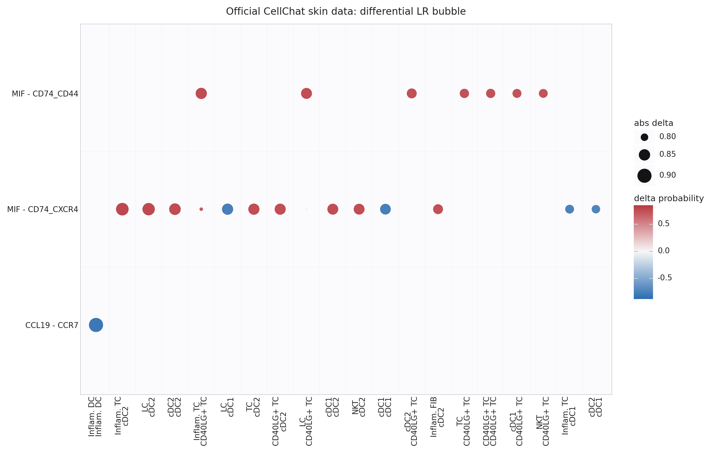
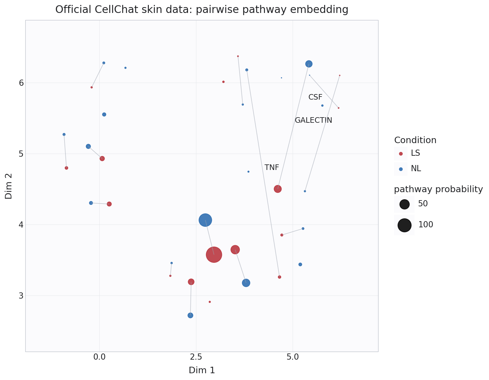
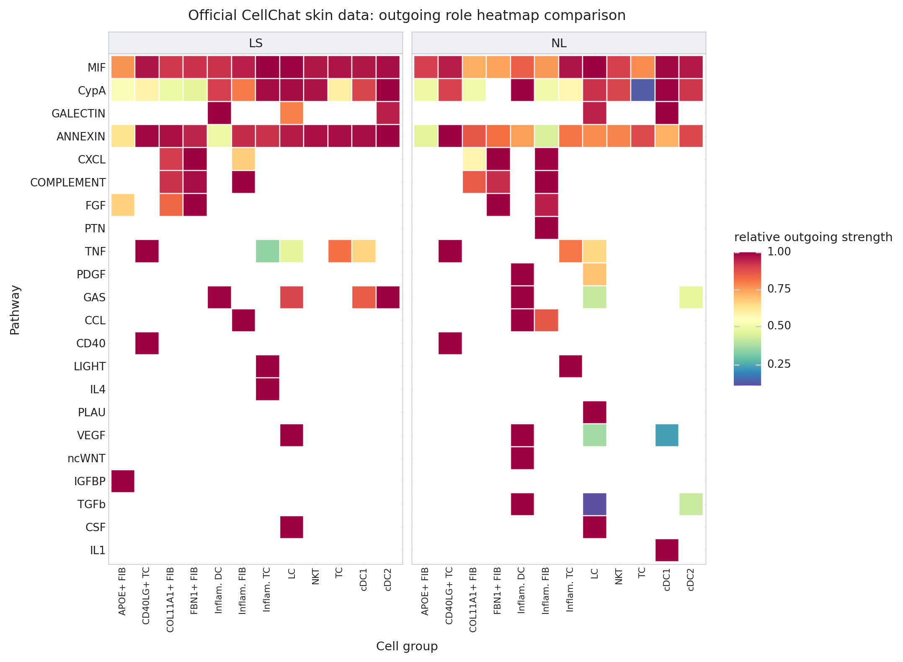
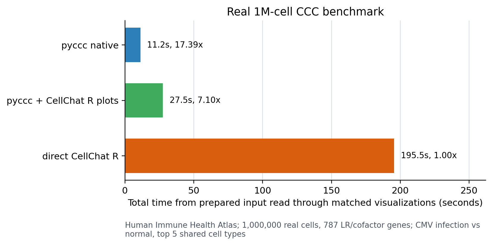

# pyccc

[](https://github.com/cheneyyu/pyccc/actions/workflows/ci.yml)
[](LICENSE)

`pyccc` is a Python/Scanpy implementation of the most useful CellChat-style
cell-cell communication workflow:

- infer ligand-receptor communication from `AnnData`
- summarize interaction count/weight networks
- aggregate signaling pathways
- identify latent communication patterns
- compare two conditions for differential CCC
- reproduce CellChat-like plot types in Matplotlib
- load official CellChatDB and OmniPath ligand-receptor resources
- experimentally predict candidate LR tables for species without curated LR DBs
- optionally import or run LIANA results

The package is intentionally AnnData-first and keeps results in tidy pandas
tables plus small network matrices, so it can be used inside Scanpy notebooks.

## Example Figures

Representative CellChat-style outputs from the official human skin vignette:

| Differential LR bubble | Pairwise pathway embedding | Outgoing role heatmap |
| --- | --- | --- |
|  |  |  |

## Publication artifacts

The repository includes manuscript-style figure artifacts assembled from
committed summary tables and generated by script.

Reproduce the PDF, vector subfigures, legend, and QA contact sheet:

```bash
uv run python scripts/make_publication_figure.py
```

See `docs/reproducibility.md` and `docs/paper/` for the artifact manifest,
source result tables, figure legend, and exact benchmark commands.

## Million-cell benchmark

On the CELLxGENE
[Human Immune Health Atlas](https://cellxgene.cziscience.com/e/e522d2cd-7927-4e59-a4ed-064009569279.cxg/)
dataset, a 1,000,000-cell no-replacement sample from the top five shared
CMV-infection-vs-normal blood cell types completes the same within-sample,
differential, and matched visualization workflow faster through pyccc:



Reproduce the benchmark:

```bash
uv run python examples/three_way_runtime_benchmark.py \
  --mode cellxgene \
  --out-dir data/runtime_benchmark/human_immune_health_atlas_real1m_raw \
  --h5ad data/cellxgene/human_immune_health_atlas_1p82m.h5ad \
  --use-raw \
  --condition-key disease \
  --condition-a "cytomegalovirus infection" \
  --condition-b normal \
  --groupby cell_type \
  --gene-symbols-key feature_name \
  --target-cells 1000000 \
  --min-cells 125000 \
  --n-groups 5 \
  --timeout-seconds 600
```

## Install

Install directly from GitHub:

```bash
python -m pip install "pyccc[ggplot,interactive,omnipath] @ git+https://github.com/cheneyyu/pyccc.git@main"
```

For development, clone the repository and create the local `uv` environment in
one step:

```bash
git clone https://github.com/cheneyyu/pyccc.git
cd pyccc
uv sync --extra dev --extra ggplot --extra interactive --extra omnipath --extra docs
uv run pytest -q
```

Add LIANA support only when you need LIANA import helpers:

```bash
python -m pip install "pyccc[ggplot,interactive,omnipath,liana] @ git+https://github.com/cheneyyu/pyccc.git@main"
```

Add experimental DB-free LR prediction dependencies only when needed:

```bash
python -m pip install "pyccc[ggplot,interactive,omnipath,predict] @ git+https://github.com/cheneyyu/pyccc.git@main"
```

## Quick Start

```python
import scanpy as sc
import pyccc as pc
import pyccc.plotting as cp
import pyccc.ggplot as cg

cp.set_theme()
adata = sc.read_h5ad("sample.h5ad")
lr = pc.load_lr_table("ligand_receptor.csv")

res = pc.compute_communication(
    adata,
    groupby="cell_type",
    lr_table=lr,
    condition_key="condition",
    condition="treated",
    score_method="cellchat",
    aggregate="tri_mean",
    n_permutations=100,
    n_jobs=4,
    population_size=True,
)

cp.net_circle(res, weight="prob")
cp.net_heatmap(res, value="prob")
cp.bubble(res, sources=["T cell"], targets=["B cell"])
cp.pathway_heatmap(res)
cp.net_individual(res, pathway="CXCL", layout="circle")
cp.signaling_role_network(res)
cp.pathway_river(res)

# ggplot-style alternatives for CellChat-like figures:
cg.bubble(res, top_n=30)
cg.pathway_heatmap(res)
cg.pathway_river(res)
```

## Input requirements

`pyccc` expects an `AnnData` object with:

- cell labels in `adata.obs[groupby]`, for example `cell_type`
- gene identifiers matching the LR table in `adata.var_names`, or gene symbols
  in `adata.var[gene_symbols_key]`
- a numeric expression matrix in `.X`, `layer=...`, or `raw.X`

For CCC scoring, use normalized/log-like expression, for example Scanpy
`normalize_total` followed by `log1p`. Raw UMI counts should be normalized into
`.X` or a layer before communication scoring, because direct count products are
strongly affected by library size. Sparse matrices are supported.

CELLxGENE h5ad files often store Ensembl IDs in `var_names` and symbols in
`adata.var["gene_symbols"]`; pass `gene_symbols_key="gene_symbols"` instead of
mutating `adata.var_names`:

```python
res = pc.compute_communication(
    adata,
    groupby="cell_type",
    lr_table=db,
    gene_symbols_key="gene_symbols",
    score_method="cellchat",
)
```

For differential analysis, comparing matched cell types is usually cleaner than
letting absent groups dominate the result. Use `align_groups="strict"` for
like-for-like samples, `intersection` for shared groups only, and `union` when
missing groups should appear as zeros.

CellChat-like probability scoring:

```python
res = pc.compute_communication(
    adata,
    groupby="cell_type",
    lr_table=db,
    score_method="cellchat",      # ligand*receptor Hill transform
    complex_aggregate="auto",     # geometric mean for CellChat-like scoring
    aggregate="tri_mean",
    n_permutations=100,
    n_jobs=-1,
)
```

For an outlier-robust mean that stays closer to CellChat's `triMean` dropout
behavior than a plain clipped mean, use `aggregate="gated_mean"`. It computes a
positive clipped mean and applies triMean-like detection gates at 25%, 50%, and
75% group expression.

```python
res = pc.compute_communication(
    adata,
    groupby="cell_type",
    lr_table=db,
    score_method="cellchat",
    aggregate="gated_mean",
    clip_quantile=0.99,
)
```

CellChat-style overexpressed gene/interactions gate:

```python
markers = pc.identify_overexpressed_genes(
    adata,
    groupby="cell_type",
    method="mean",        # fast effect-size gate; use "wilcoxon" for p-values
    min_pct=0.1,
    min_logfc=0.1,
)

res = pc.compute_communication(
    adata,
    groupby="cell_type",
    lr_table=db,
    score_method="cellchat",
    aggregate="truncated_mean",
    trim=0.1,
    de_gate=True,
    de_min_pct=0.1,
    de_min_logfc=0.1,
)
```

Million-cell sketch mode:

```python
res = pc.compute_communication(
    adata,
    groupby="cell_type",
    lr_table=db,
    score_method="cellchat",
    aggregate="mean",
    downsample_per_group=2000,
    downsample_repeats=10,
    n_permutations=0,
    random_state=0,
)

# Additional sketch columns:
# prob_std: sampling variability
# stability: fraction of sketches where the LR/source/target was detected
```

Spatial distance decay:

```python
res_spatial = pc.compute_communication(
    adata,
    groupby="cell_type",
    lr_table=lr,
    spatial_key="spatial",
    distance_decay=150.0,
)
cp.spatial_network(adata, res_spatial)
```

Cofactor-aware scoring with CellChatDB metadata:

```python
res_cofactor = pc.compute_communication(
    adata,
    groupby="cell_type",
    lr_table=db,
    cofactor_adjust=True,
    cofactor_kh=0.5,
    cofactor_hill=1.0,
)
```

Use the official CellChat database directly:

```python
db = pc.load_cellchatdb("human")
mouse_db = pc.load_cellchatdb("mouse", category="Secreted Signaling")

# Use an explicit cache location when needed:
db = pc.load_cellchatdb(
    "human",
    category=["Secreted Signaling", "ECM-Receptor"],
    cache_dir="/tmp/pyccc-cache",
)

res = pc.compute_communication(adata, "cell_type", db)
cp.bubble(res, size_by="pvalue")  # after running with permutations
```

Load common external LR resources through OmniPath:

```python
omni = pc.load_omnipath_interactions(
    organism="mouse",
    resources=["CellChatDB", "CellPhoneDB", "LRdb"],
)
omni_cellchat = pc.filter_lr_table(omni, resources="CellChatDB")
```

For downloaded CSV/TSV/Parquet LR tables, pyccc accepts `ligand`/`receptor`
columns and common OmniPath-style aliases such as `source_genesymbol` and
`target_genesymbol`.

Experimental DB-free target-species CCC:

```python
predicted_db = pc.predict_lr_dbfree(
    adata,
    protein_fasta="target.longest_protein.fa",
    gene_id_key="gene_id",
    species_name="target_species",
    density_prior="auto",
    embedding_model_name=pc.ESMC_300M_MODEL_NAME,
    min_score=0.50,
    max_pairs=50000,
    nearest_neighbor_pairs=10000,  # optional ESMC-space recall candidates
)

res = pc.compute_communication(
    adata,
    groupby="cell_type",
    lr_table=predicted_db,
    gene_symbols_key="gene_id",
    score_method="cellchat",
)
```

The production DB-free stack is explicitly `ESMC-300M embedding -> LightGBM
protein role classifiers -> LightGBM pair ranker -> clade-aware density prior`.
The universal LightGBM role and pair models are bundled with the Python package,
so `predict_lr_dbfree(...)` works after a normal `pyccc[predict]` install unless
you pass custom `role_model` or `model` paths. Hash embeddings, heuristic
role/ranker models, and scalar density priors are fixture paths for tests or dry
runs only.

See `docs/lr_resources.md`, `docs/lr_resource_training.md`,
`docs/dbfree_ccc.md`, and `docs/spatial_validation.md` for the experimental
predictor workflow and limitations.

Run the official CellChat human skin vignette data through pyccc plotnine
figures:

```bash
uv run python examples/cellchat_official_plotnine_demo.py
```

This example downloads the official CellChat tutorial RDA from figshare, loads
CellChatDB v2 from `jinworks/CellChat`, and saves CellChat-like bubble, pathway
heatmap, river, pattern-dot, pattern-river, and differential figures.

Run a backed CELLxGENE blood-vs-lung benchmark without rewriting gene names:

```bash
uv run --extra ggplot python examples/cellxgene_blood_lung_benchmark.py \
  --h5ad data/cellxgene/global_celltypist_immune_329k.h5ad \
  --gene-symbols-key gene_symbols \
  --out-dir data/cellxgene/benchmark_blood_lung_gene_symbols
```

The script reads the large h5ad in backed mode, samples matched cell types,
runs `compare_samples`, writes differential TSV files, and saves plotnine
differential bubble/rank figures when plotnine is installed.

Latent communication patterns:

```python
patterns = pc.compute_communication_patterns(res, mode="outgoing", n_patterns=3)
selection = pc.select_communication_pattern_number(res, mode="outgoing", k_range=range(2, 8))
cg.pattern_number_plot(selection)
# Or pin the highlighted candidate explicitly:
cg.pattern_number_plot(selection, recommended_k=3)
cg.pattern_dot(patterns)
cg.pattern_river(patterns)

# CellChat-style pathway network similarity and embedding:
similarity = pc.compute_pathway_similarity(res, similarity="functional")
embedding = pc.compute_pathway_embedding(res, similarity="functional", method="auto")
groups = pc.compute_pathway_clusters(res, similarity="functional", method="spectral")
cg.pathway_embedding(res, cluster=True)

# CellChat plotGeneExpression-style expression dot plot:
expr = pc.signaling_expression_frame(adata, result=res, signaling="CXCL")
cg.signaling_gene_expression(adata, result=res, signaling="CXCL")

# Interactive HTML for inspecting dense rivers:
fig = pc.interactive_pattern_river(patterns)
pc.save_interactive_html(fig, "pyccc_pattern_river.html")
```

Differential CCC:

```python
ctrl = pc.compute_communication(adata, "cell_type", lr, condition_key="condition", condition="ctrl")
stim = pc.compute_communication(adata, "cell_type", lr, condition_key="condition", condition="stim")
diff = pc.compare_communication(stim, ctrl)

# Or compare two samples directly:
diff = pc.compare_samples(
    stim_adata,
    ctrl_adata,
    groupby="cell_type",
    lr_table=lr,
    label_a="stim",
    label_b="ctrl",
    align_groups="union",  # fill missing cell groups with zero networks
    score_method="cellchat",
    aggregate="truncated_mean",
    trim=0.1,
    de_gate=True,
)

cp.compare_interactions(diff)
cp.diff_network_circle(diff, measure="weight")
cp.diff_network_circle(diff, measure="count")
cp.diff_heatmap(diff, measure="weight")
cp.diff_bubble(diff, top_n=30)
cp.rank_signaling_compare(diff, stacked=True)  # CellChat rankNet stacked mode
cp.signaling_changes_scatter(diff, group=diff.groups[0])
cp.signaling_role_heatmap_compare(diff, mode="outgoing")
cp.pathway_embedding_pairwise(diff)
cp.pathway_similarity_rank(diff)
cp.diff_pathway_rank(diff, measure="weight")
cp.diff_source_target_rank(diff, measure="count")
cp.key_plot_gallery(stim, diff)
pc.save_cellchat_report(stim, "pyccc_report.pdf", diff=diff)

# CellChat-style differential tables:
diff.pathway_changes.head()
diff.source_target_changes.head()
diff.differential_network(measure="count")
pc.signaling_changes(diff, group=diff.groups[0]).head()
pc.pairwise_pathway_embedding(diff).head()
pc.rank_pathway_similarity(diff).head()
```

## CellChat-style plot coverage

Implemented plotting functions in `pyccc.plotting`:

- `net_circle`: CellChat `netVisual_circle` style weighted circular graph
- `net_heatmap`: source-target interaction heatmap
- `net_chord`: chord-like circular edge diagram
- `net_chord_gene`: CellChat `netVisual_chord_gene`-style LR/pathway-mediated chord graph
- `net_individual`: CellChat `netVisual_individual`-style hierarchy/circle/chord network for one LR pair
- `net_hierarchy`: left-to-right sender/receiver hierarchy diagram
- `bubble`: ligand-receptor bubble plot
- `dotplot`: pathway or LR dot plot
- `pathway_heatmap`: pathway-level source-target heatmap
- `pathway_embedding`: CellChat-style signaling pathway UMAP/MDS embedding with optional network clusters
- `signaling_gene_expression`: AnnData-native `plotGeneExpression`-style dot/violin/bar plots
- `lr_contribution`: ligand-receptor contribution within a pathway
- `lr_contribution_multi`: faceted/multi-panel ligand-receptor contribution for several pathways
- `annotation_bar`: CellChatDB annotation-class communication composition
- `pathway_river`: CellChat-style alluvial river from cell groups to pathways
- `signaling_role_scatter`: outgoing vs incoming centrality
- `signaling_role_heatmap`: outgoing/incoming pathway roles by cell group
- `signaling_role_heatmap_compare`: CellChat comparison tutorial-style side-by-side outgoing/incoming/all role heatmaps
- `signaling_role_network`: sender/receiver/mediator/influencer role heatmap
- `rank_signaling`: ranked pathway/LR strength
- `compare_interactions`: condition-level count/weight comparison
- `rank_signaling_compare`: ranked pathway/LR comparison between conditions, including CellChat `rankNet(..., stacked = TRUE)` style via `stacked=True`
- `signaling_changes_scatter`: CellChat `netAnalysis_signalingChanges_scatter`-style pathway changes for one cell group
- `pathway_embedding_pairwise`: CellChat `netVisual_embeddingPairwise`-style joint pathway embedding across two conditions
- `pathway_similarity_rank`: CellChat `rankSimilarity`-style pathway distance ranking in a joint manifold
- `diff_network_circle`: differential network circle
- `diff_heatmap`: differential source-target heatmap
- `diff_bubble`: differential ligand-receptor bubble plot
- `diff_pathway_rank`: CellChat `rankNet`-style pathway differential ranking
- `diff_source_target_rank`: source-target differential ranking
- `spatial_network`: spatial communication overlay using `adata.obsm["spatial"]`
- `key_plot_gallery`: ready-to-save multi-panel CellChat-style summary
- `save_cellchat_report`: multi-page PDF report with CellChat-style visual panels

Plotnine equivalents are available in `pyccc.ggplot` for `bubble`,
`diff_bubble`, `dotplot`, `pathway_heatmap`, `rank_signaling`,
`rank_signaling_compare`, `compare_interactions`, `diff_pathway_rank`,
`diff_source_target_rank`, `signaling_role_scatter`, `lr_contribution`,
`lr_contribution_multi`,
`signaling_role_heatmap_compare`,
`pathway_embedding`,
`signaling_gene_expression`,
`signaling_changes_scatter`,
`pathway_embedding_pairwise`,
`pathway_similarity_rank`,
`pathway_river`,
`pattern_dot`, and `pattern_river`.
`pattern_number_plot` summarizes candidate pattern counts and highlights an
elbow-style recommended k unless `recommended_k` is supplied.
Interactive Plotly HTML versions are available via
`interactive_pathway_river`, `interactive_pattern_river`, and
`save_interactive_html`.

The implementation aims to match CellChat's analytical and visual vocabulary,
not to be a byte-for-byte port of the R plotting code.

Current gaps versus CellChat remain: exact R implementation parity checks,
full CellChat statistical/reporting parity, exact Seurat stacked-violin layout parity, and
exact `circlize` chord geometry.

See `docs/cellchat_visual_coverage.md` for the current CellChat-style visual
coverage matrix.

For direct visual comparison against real CellChat R output, run:

```bash
uv run python examples/cellchat_plot_comparison.py
```

This writes paired pyccc Python PNGs, paired CellChat R PNGs, and an A4 merged
comparison PDF under `cellchat_plot_comparison/`.

To send pyccc results back to R users for CellChat plotting, export a CellChat
bridge directory and convert it to a minimal CellChat `.rds` object:

```python
res = pc.compute_communication(adata, "cell_type", db, score_method="cellchat")
pc.export_cellchat(
    res,
    "pyccc_cellchat_export",
    lr_table=db,
    group_sizes=adata.obs["cell_type"].value_counts(),
)
```

```bash
Rscript pyccc_cellchat_export/pyccc_to_cellchat.R \
  pyccc_cellchat_export \
  pyccc_cellchat_export/cellchat_from_pyccc.rds \
  pyccc_cellchat_export/plots
```

The R helper fills `net`, `netP`, `LR`, `DB`, and `idents` slots so common
CellChat plotting functions such as `netVisual_circle`, `netVisual_bubble`,
`netVisual_heatmap`, `rankNet`, and `netVisual_aggregate` can operate on the
exported probabilities.

For two-sample differential CCC, pyccc can also export both samples as a
merged CellChat object for R-native comparison plotting:

```python
ctrl = pc.compute_communication(adata, "cell_type", db, condition_key="condition", condition="ctrl")
stim = pc.compute_communication(adata, "cell_type", db, condition_key="condition", condition="stim")
diff = pc.compare_communication(stim, ctrl, label_a="stim", label_b="ctrl")

pc.export_cellchat_merged(
    diff,
    "pyccc_cellchat_merged_export",
    lr_table=db,
    group_sizes_a=adata.obs.loc[adata.obs["condition"] == "stim", "cell_type"].value_counts(),
    group_sizes_b=adata.obs.loc[adata.obs["condition"] == "ctrl", "cell_type"].value_counts(),
)
```

```bash
Rscript pyccc_cellchat_merged_export/pyccc_to_merged_cellchat.R \
  pyccc_cellchat_merged_export \
  pyccc_cellchat_merged_export/merged_cellchat_from_pyccc.rds \
  pyccc_cellchat_merged_export/plots
```

The merged helper calls CellChat's `mergeCellChat`, then writes comparison
plots from `compareInteractions`, `netVisual_diffInteraction`, and
`rankNet(mode = "comparison")`. The export directory also contains TSV copies
of pyccc's LR-level, pathway-level, source-target, network-delta, and
count-delta differential tables.

## Scaling notes

The core inference path is CPU/NumPy/SciPy and is the supported route for
routine within-sample and two-sample differential workflows. The optional
`array_backend` argument is retained for compatibility and accepts only
`None`, `"cpu"`, or `"numpy"`.

See `docs/million_cell_scaling.md` for large-dataset benchmark guidance and
the current 1M-cell runtime comparison.
