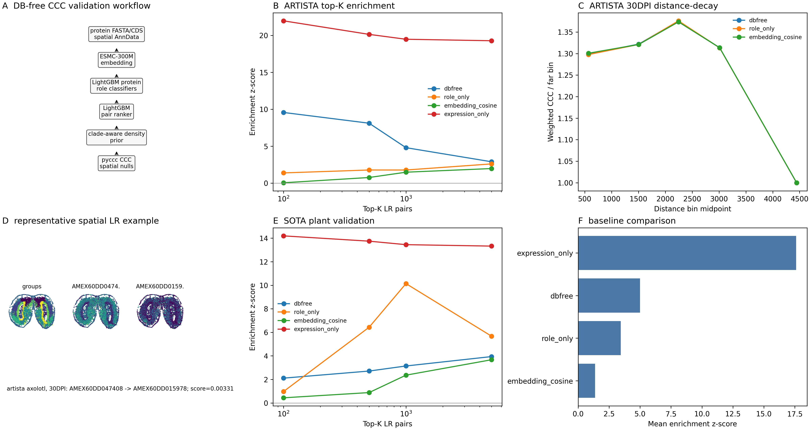

# Real-Data DB-Free Spatial Validation

This workflow validates DB-free target-species CCC on real special-species
spatial transcriptomics. It does not retrain the DB-free predictor. It produces
local source tables and a documentation summary figure from ARTISTA axolotl and
SOTA soybean spatial sections.

The conservative claim is:

> DB-free LR candidates from ESMC-300M embedding, LightGBM protein role
> classifiers, a LightGBM pair ranker, and a clade-aware density prior are
> spatially enriched against matched-random, coordinate, cell-type, and
> score-permutation null models in non-standard species where a curated
> target-species LR database is not used.

Predicted LR edges are computational candidates, not validated biochemical
binding events.

## Current Real-Data Snapshot

The current documentation figure was generated from ARTISTA axolotl
`Control_Juv`, `5DPI_1`, and `30DPI` sections plus SOTA soybean `SAM` and
`Leaf` sections. Final top-K enrichment uses `exp` kernel,
`model_weighted_spatial_ccc_score`, `matched_random_lr` null rows, random seed
0, and 1000 permutations.



Generated source tables are intentionally kept under ignored
`results/dbfree_validation/` because they are reproducible from the manifests
and scripts and are too draft-like for the package repository.

ARTISTA passes the main spatial gate in all three required sections:

| Section | Top-K | Enrichment z | Empirical p |
| --- | ---: | ---: | ---: |
| Control_Juv | 500 | 8.80 | 0.000999 |
| Control_Juv | 1000 | 5.53 | 0.000999 |
| 5DPI_1 | 500 | 8.42 | 0.000999 |
| 5DPI_1 | 1000 | 4.55 | 0.000999 |
| 30DPI | 500 | 7.10 | 0.000999 |
| 30DPI | 1000 | 4.30 | 0.001998 |

SOTA is framed as cross-kingdom feasibility. `SAM` is positive, while `Leaf`
is a negative section under the same gate:

| Section | Top-K | Enrichment z | Empirical p |
| --- | ---: | ---: | ---: |
| SAM | 500 | 7.54 | 0.000999 |
| SAM | 1000 | 9.03 | 0.000999 |
| Leaf | 500 | -2.12 | 0.994006 |
| Leaf | 1000 | -2.75 | 0.999001 |

Expression-only ranking is included as a deliberately strong non-sequence
baseline and can be highly spatially enriched because it favors broadly
co-expressed genes. The DB-free claim should therefore not be overstated as
biochemical validation or as dominance over every expression-driven baseline.
The supported claim is that target-species DB-free candidate LR tables are
spatially plausible against controlled nulls and outperform sequence-only and
role-only controls in the ARTISTA primary analysis.

## Data Sources

The committed manifests are the single source of truth:

- `configs/dbfree_validation/artista_axolotl.yaml`
- `configs/dbfree_validation/sota_soybean.yaml`

The ARTISTA manifest uses the ARTISTA download page for axolotl Stereo-seq
h5ad sections, including `Stage44.h5ad`, `Control_Juv.h5ad`, `5DPI_1.h5ad`,
and `30DPI.h5ad`.

The SOTA manifest uses the SOTA soybean download page for `SAM.spatial.h5ad`
and `Leaf.spatial.h5ad`.

`required_final_sections` records the sections that must be prepared before a
publishable final run can pass acceptance: `Control_Juv`, `5DPI_1`, and
`30DPI` for ARTISTA; `SAM` and `Leaf` for SOTA.

Each manifest also records a target-species `protein_source`: URL, raw local
FASTA path, gene-ID regex, optional gene-ID replacements, and isoform selection
rule. `prepare_target_proteome.py` converts that raw source into the normalized
`protein_fasta` path used by prediction, with one longest protein per gene and
headers rewritten as `gene=<expression_gene_id>`. When
`restrict_to_expression` is enabled, that prediction FASTA is further limited
to genes present in the prepared spatial sections, avoiding unnecessary
ESMC-300M embedding of proteins that cannot enter the CCC analysis.

## Reproduce

Install the prediction-capable environment first:

```bash
git clone https://github.com/cheneyyu/pyccc.git
cd pyccc
uv sync --extra dev --extra docs --extra predict
```

Run the data and proteome preparation scripts for each manifest:

```bash
uv run python scripts/download_dbfree_validation_data.py \
  --manifest configs/dbfree_validation/artista_axolotl.yaml \
  --include-proteome

uv run python scripts/prepare_dbfree_validation_data.py \
  --manifest configs/dbfree_validation/artista_axolotl.yaml

uv run python scripts/prepare_target_proteome.py \
  --manifest configs/dbfree_validation/artista_axolotl.yaml

uv run python scripts/download_dbfree_validation_data.py \
  --manifest configs/dbfree_validation/sota_soybean.yaml \
  --include-proteome

uv run python scripts/prepare_dbfree_validation_data.py \
  --manifest configs/dbfree_validation/sota_soybean.yaml

uv run python scripts/prepare_target_proteome.py \
  --manifest configs/dbfree_validation/sota_soybean.yaml
```

Run final top-K spatial validation with the memory-light top-K path:

```bash
uv run python scripts/run_dbfree_spatial_validation.py \
  --manifest configs/dbfree_validation/artista_axolotl.yaml \
  --section Control_Juv \
  --section 5DPI_1 \
  --section 30DPI \
  --n-permutations 1000 \
  --top-k-only

uv run python scripts/run_dbfree_spatial_validation.py \
  --manifest configs/dbfree_validation/sota_soybean.yaml \
  --section SAM \
  --section Leaf \
  --n-permutations 1000 \
  --top-k-only

uv run python scripts/make_dbfree_spatial_validation_figure.py \
  --results-dir results/dbfree_validation

uv run python scripts/check_dbfree_validation_acceptance.py \
  --manifest configs/dbfree_validation/artista_axolotl.yaml \
  --manifest configs/dbfree_validation/sota_soybean.yaml \
  --results-dir results/dbfree_validation
```

For CI or local smoke tests, add `--smoke-only` and use a small
`--n-permutations` value. The `--top-k-only` mode computes observed LR
summaries and top-K enrichment without writing a per-pair null distribution;
targeted tests verify that it matches the full null-distribution path on
small data. Set `compute_distance_decay: true` or
`compute_section_reproducibility: true` in `spatial_validation` when those
diagnostic source tables are needed. Set
`write_celltype_pair_summary: true` or `write_null_distribution: true` only
when those large intermediate tables are explicitly needed for audit.
`spatial_weight_max_cells` controls the stratified cell/bin sample used for
the repeated spatial kernel reductions in final top-K validation.

## Outputs

The pipeline writes:

- `results/dbfree_validation/download_manifest.tsv`
- `results/dbfree_validation/*/section_qc.tsv`
- `results/dbfree_validation/*/gene_protein_match.tsv`
- `results/dbfree_validation/*/predicted_lr.tsv`
- `results/dbfree_validation/*/prediction_summary.tsv`
- `results/dbfree_validation/*/spatial_validation_summary.tsv`
- `results/dbfree_validation/*/spatial_validation_celltype_pair_summary.tsv`
  when `write_celltype_pair_summary` is enabled
- `results/dbfree_validation/*/spatial_validation_null_distribution.tsv`
  when `write_null_distribution` is enabled
- `results/dbfree_validation/*/spatial_validation_top_k_enrichment.tsv`
- `results/dbfree_validation/*/spatial_validation_distance_decay.tsv`
  when `compute_distance_decay` is enabled
- `results/dbfree_validation/*/spatial_validation_section_reproducibility.tsv`
  when `compute_section_reproducibility` is enabled
- `results/dbfree_validation/baseline_comparison.tsv`
- `results/dbfree_validation/baseline_topk_enrichment.tsv`
- `figures/dbfree_spatial_validation_main.png`
- `figures/dbfree_spatial_validation_main.svg`
- `figures/dbfree_spatial_validation_main.pdf`
- `figures/dbfree_spatial_validation_main_legend.md`
- `figures/dbfree_spatial_validation_main_source_tables.tar.gz`
- `results/dbfree_validation/acceptance_report.tsv`

`spatial_validation_top_k_enrichment.tsv` includes a `null_model` column.
Rows are written for each individual null model plus a `pooled` summary. The
main figure and acceptance gates use `matched_random_lr` rows when available.

Final figure tables must not contain fixture warnings such as
`hash_embedding_backend`, `heuristic_role_model`, `heuristic_pair_ranker`, or
`default_unknown_density`.

## Acceptance Gates

For ARTISTA, a publishable run requires at least two of three selected main
sections to have top-500 or top-1000 DB-free enrichment z-score at least 2,
empirical p-value at most 0.05 against matched random LR, and improvement over
role-only or materially better top-K stability.

For SOTA, a feasibility run requires at least one of two organs to have
positive DB-free enrichment over matched random LR.

Gene/protein mapping gates are recorded in
`gene_protein_match_summary.tsv`: ARTISTA requires at least 60 percent of
expressed genes to map to target proteins, and SOTA requires at least
70 percent.

`check_dbfree_validation_acceptance.py` exits non-zero until all required
data, sequence, model, spatial, figure, and reproducibility gates pass. This is
expected during smoke tests before real target proteomes and trained models are
available.
