# Plotting gallery

This page is generated by `scripts/generate_plotting_gallery.py`. Each entry shows a minimal call and the rendered artifact created from the same synthetic AnnData example.

The static Matplotlib and plotnine APIs render PNG files. Plotly helpers render standalone HTML files and a small generated preview card because the documentation build does not depend on a browser screenshot runtime.

## Setup used by all examples

```python
import pyccc as pc
import pyccc.plotting as cp
import pyccc.ggplot as cg

# result: CCCResult for the treated sample
# diff: DifferentialCCC comparing treated against control
# adata: the source AnnData used for expression and spatial examples
# patterns: communication patterns computed from result
```

## Matplotlib API

### `set_theme`

`set_theme(context: 'str' = 'notebook', font_scale: 'float' = 1.0, style: 'str' = 'nature') -> 'None'`

Set a compact publication-style Matplotlib/Seaborn theme.

```python
cp.set_theme(font_scale=0.9)
cp.net_circle(result)
```


### `save_figure`

`save_figure(fig, path: 'str', *, dpi: 'int' = 360, transparent: 'bool' = False, also_svg: 'bool' = True) -> 'None'`

Save a figure as high-resolution PNG and optionally matching SVG.

```python
fig, ax = plt.subplots()
cp.net_circle(result, ax=ax)
cp.save_figure(fig, "network.png")
```

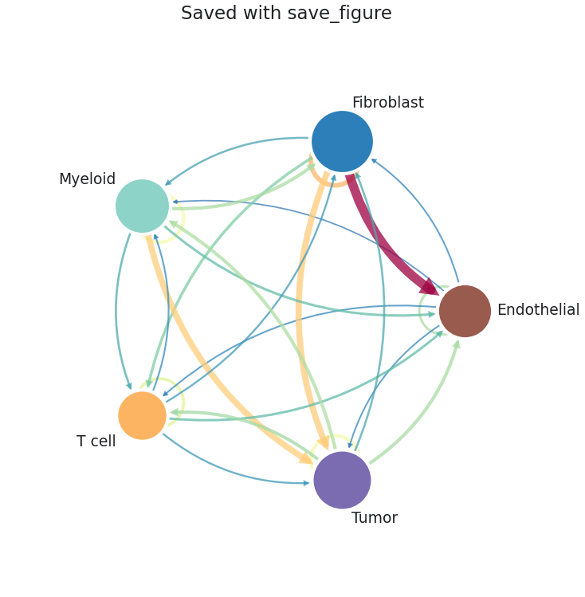

### `net_circle`

`net_circle(result: 'CCCResult', *, weight: 'str' = 'prob', pathway: 'str | Sequence[str] | None' = None, significant_only: 'bool' = False, ax=None, cmap: 'str' = 'pyccc_cells', edge_cmap: 'str' = 'pyccc_prob', title: 'str | None' = None)`

CellChat `netVisual_circle` style circular weighted network.

```python
cp.net_circle(result)
```


### `net_chord`

`net_chord(result: 'CCCResult', *, weight: 'str' = 'prob', pathway: 'str | Sequence[str] | None' = None, top_n: 'int | None' = 60, significant_only: 'bool' = False, ax=None, cmap: 'str' = 'pyccc_cells', title: 'str | None' = None)`

Chord-like circular diagram for source-target communication.

```python
cp.net_chord(result, top_n=30)
```

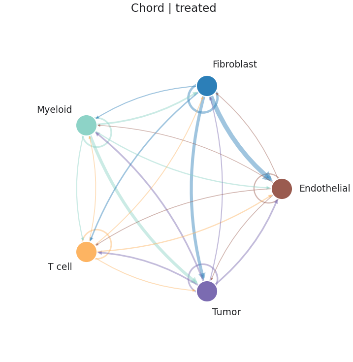

### `net_chord_gene`

`net_chord_gene(result: 'CCCResult', *, sources: 'Sequence[str] | None' = None, targets: 'Sequence[str] | None' = None, pathways: 'Sequence[str] | None' = None, interactions: 'Sequence[str] | None' = None, level: 'str' = 'lr', top_n: 'int | None' = 30, significant_only: 'bool' = False, ax=None, cmap: 'str' = 'pyccc_cells', title: 'str | None' = None)`

CellChat `netVisual_chord_gene` style LR/pathway-mediated chord graph.

```python
cp.net_chord_gene(result, pathways=["CXCL", "MIF"], top_n=20)
```

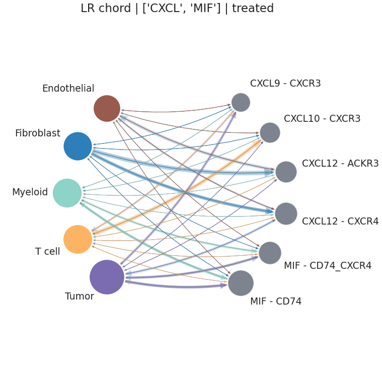

### `net_individual`

`net_individual(result: 'CCCResult', *, pathway: 'str | Sequence[str] | None' = None, interaction: 'str | Sequence[str] | None' = None, ligand: 'str | Sequence[str] | None' = None, receptor: 'str | Sequence[str] | None' = None, layout: 'str' = 'circle', vertex_receiver: 'Sequence[str | int] | None' = None, significant_only: 'bool' = False, ax=None, cmap: 'str' = 'pyccc_cells', title: 'str | None' = None)`

CellChat `netVisual_individual` style network for one ligand-receptor pair.

```python
cp.net_individual(result, pathway="CXCL", layout="circle")
```

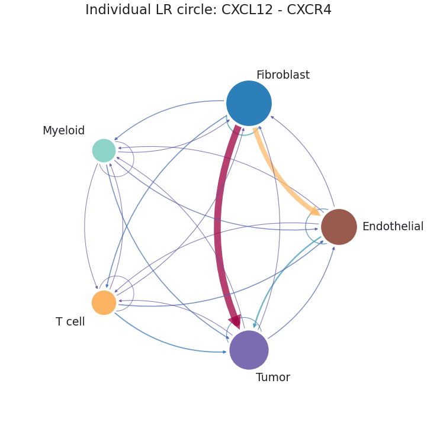

### `net_hierarchy`

`net_hierarchy(result: 'CCCResult', *, sources: 'Sequence[str] | None' = None, targets: 'Sequence[str] | None' = None, pathway: 'str | Sequence[str] | None' = None, weight: 'str' = 'prob', significant_only: 'bool' = False, ax=None, title: 'str | None' = None)`

Sender-to-receiver hierarchy diagram similar to CellChat hierarchy plots.

```python
cp.net_hierarchy(result, pathway="CXCL", targets=["Tumor", "Myeloid"])
```

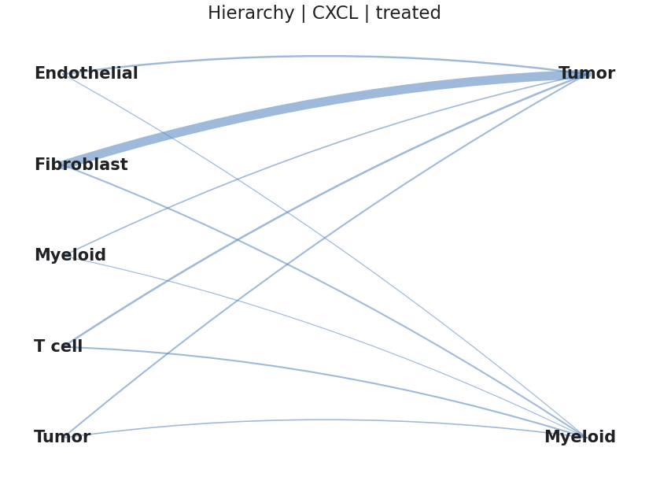

### `net_heatmap`

`net_heatmap(result: 'CCCResult', *, value: 'str' = 'prob', pathway: 'str | Sequence[str] | None' = None, significant_only: 'bool' = False, ax=None, cmap: 'str' = 'pyccc_prob', annot: 'bool' = False, cluster_rows: 'bool' = False, cluster_cols: 'bool' = False, title: 'str | None' = None)`

Source-target interaction heatmap.

```python
cp.net_heatmap(result, cluster_rows=True, cluster_cols=True)
```

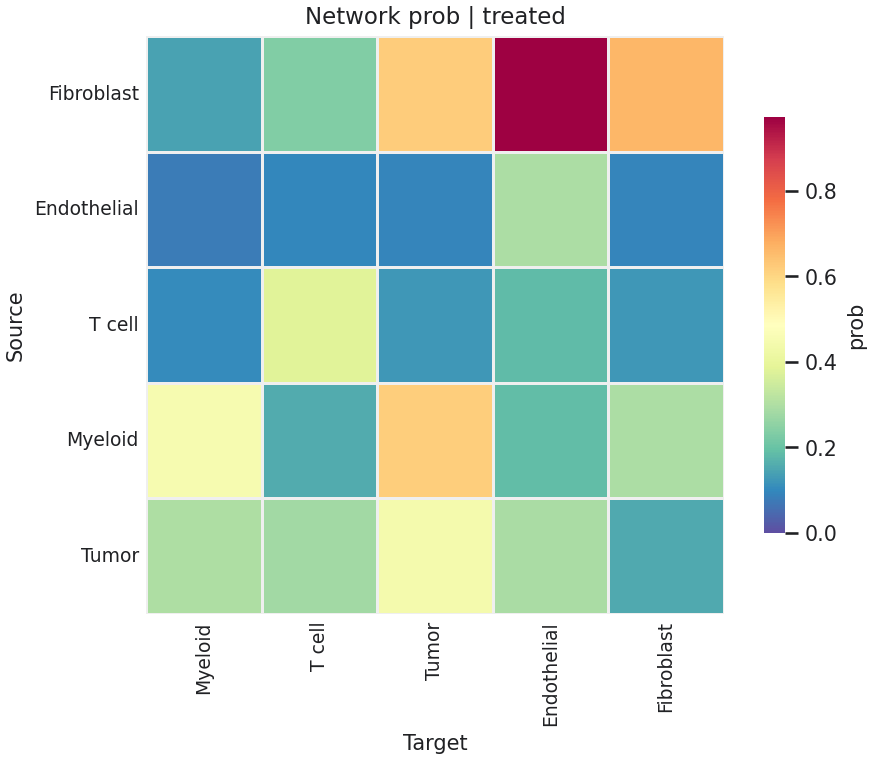

### `pathway_heatmap`

`pathway_heatmap(result: 'CCCResult', *, pathways: 'Sequence[str] | None' = None, source: 'str | None' = None, target: 'str | None' = None, top_pairs: 'int | None' = None, compact_pairs: 'bool' = False, significant_only: 'bool' = False, ax=None, cmap: 'str' = 'pyccc_prob', cluster_rows: 'bool' = False, cluster_cols: 'bool' = False, title: 'str | None' = None)`

Heatmap of pathway activity across source-target pairs.

```python
cp.pathway_heatmap(result, top_pairs=14, compact_pairs=True)
```

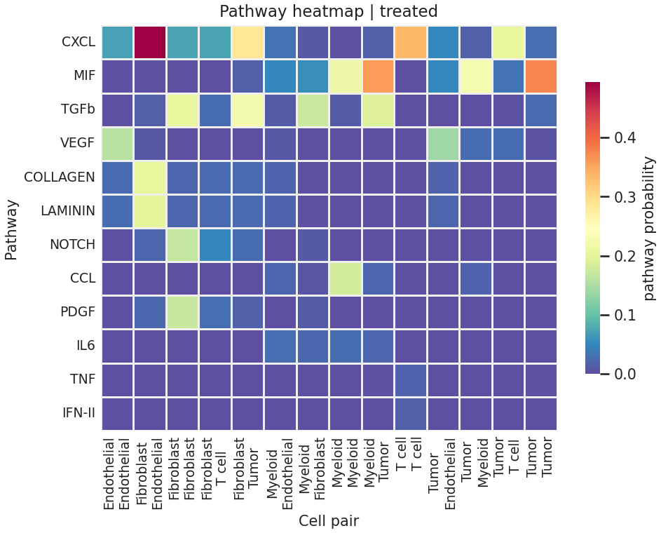

### `bubble`

`bubble(result: 'CCCResult', *, sources: 'Sequence[str] | None' = None, targets: 'Sequence[str] | None' = None, pathways: 'Sequence[str] | None' = None, interactions: 'Sequence[str] | None' = None, top_n: 'int | None' = None, top_pairs: 'int | None' = None, compact_pairs: 'bool' = False, size_by: 'str' = 'prob', max_pvalue: 'float | None' = None, show_size_legend: 'bool' = True, significant_only: 'bool' = False, ax=None, cmap: 'str' = 'pyccc_prob', title: 'str | None' = None)`

Ligand-receptor bubble plot across source-target cell pairs.

```python
cp.bubble(result, top_n=16, top_pairs=10, compact_pairs=True)
```

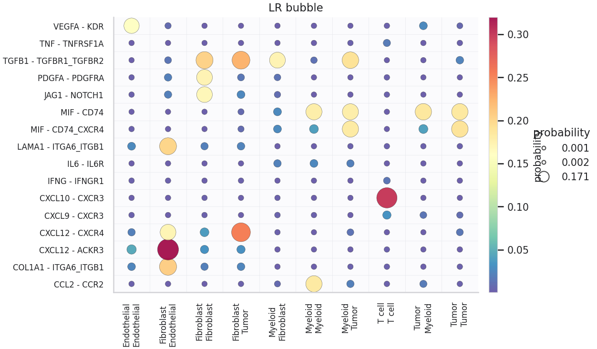

### `dotplot`

`dotplot(result: 'CCCResult', *, level: 'str' = 'pathway', top_n: 'int' = 30, ax=None, cmap: 'str' = 'pyccc_prob', title: 'str | None' = None, show_size_legend: 'bool' = True)`

Dotplot ranking pathways or ligand-receptor pairs by activity.

```python
cp.dotplot(result, top_n=16)
```

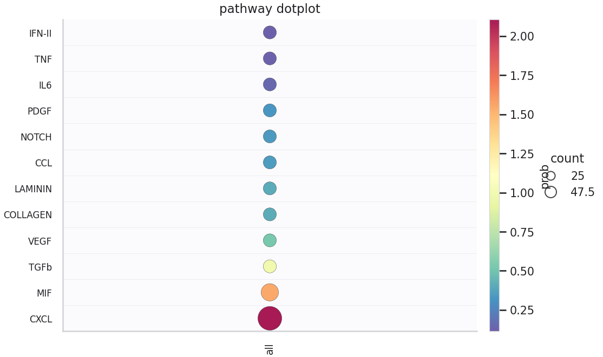

### `signaling_role_scatter`

`signaling_role_scatter(result: 'CCCResult', *, pathways: 'str | Sequence[str] | None' = None, significant_only: 'bool' = False, ax=None, label: 'bool' = True, cmap: 'str' = 'pyccc_cells', size_range: 'tuple[float, float]' = (70, 260), title: 'str | None' = None)`

Incoming vs outgoing signaling role scatter.

```python
cp.signaling_role_scatter(result)
```

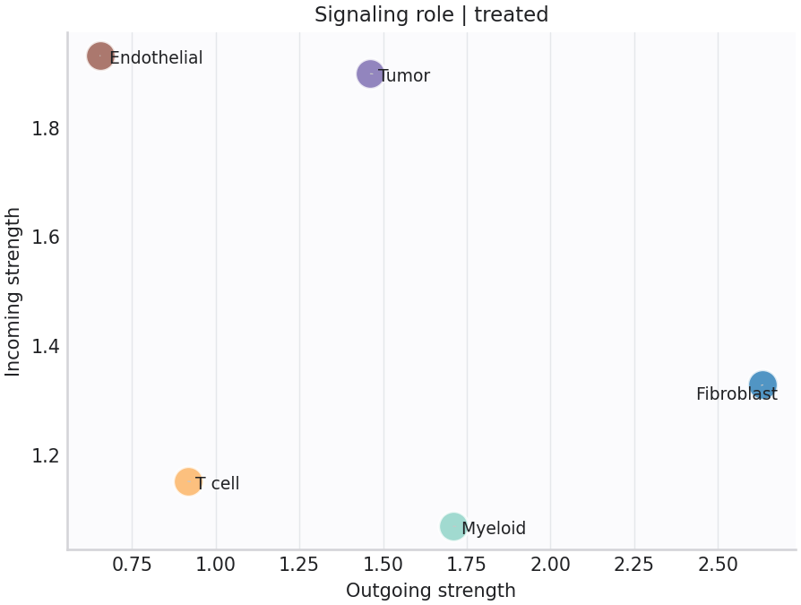

### `rank_signaling`

`rank_signaling(result: 'CCCResult', *, level: 'str' = 'pathway', top_n: 'int' = 30, ax=None, color: 'str' = '#4f81bd', title: 'str | None' = None)`

Rank pathways or LR pairs by total communication probability.

```python
cp.rank_signaling(result, top_n=12)
```

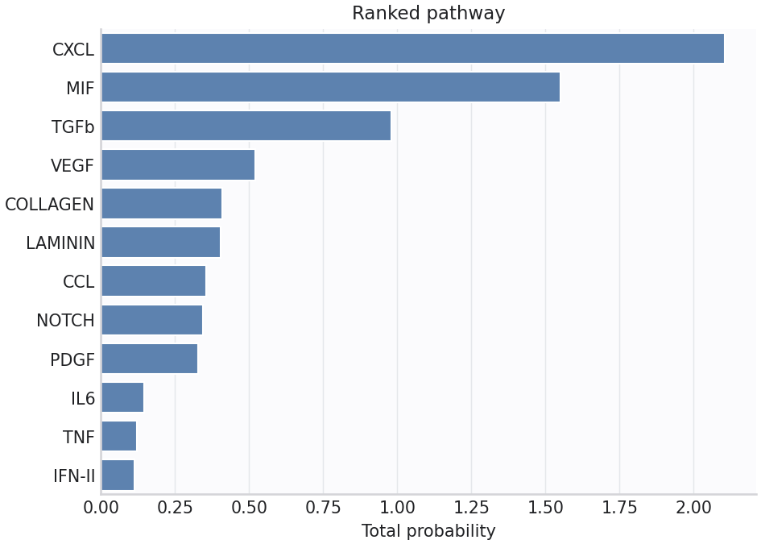

### `annotation_bar`

`annotation_bar(result: 'CCCResult', *, value: 'str' = 'prob', significant_only: 'bool' = False, ax=None, title: 'str | None' = None)`

Bar plot of communication burden by CellChatDB annotation class.

```python
cp.annotation_bar(result)
```

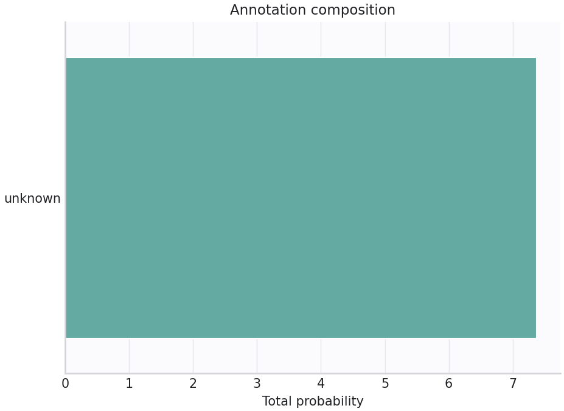

### `lr_contribution`

`lr_contribution(result: 'CCCResult', pathway: 'str', *, top_n: 'int' = 20, ax=None, color: 'str' = '#6f63b6', title: 'str | None' = None)`

Contribution of ligand-receptor pairs within one signaling pathway.

```python
cp.lr_contribution(result, "CXCL", top_n=8)
```

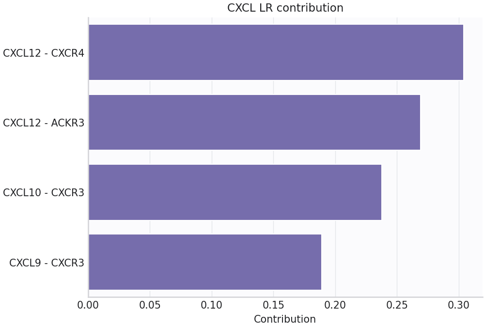

### `lr_contribution_multi`

`lr_contribution_multi(result: 'CCCResult', *, pathways: 'Sequence[str] | None' = None, top_pathways: 'int' = 6, top_n: 'int' = 8, ncols: 'int' = 2, significant_only: 'bool' = False, color: 'str' = '#6f63b6', title: 'str | None' = None)`

Multi-panel CellChat `netAnalysis_contribution`-style LR contribution plot.

```python
cp.lr_contribution_multi(result, pathways=["CXCL", "MIF", "TGFb", "VEGF"])
```

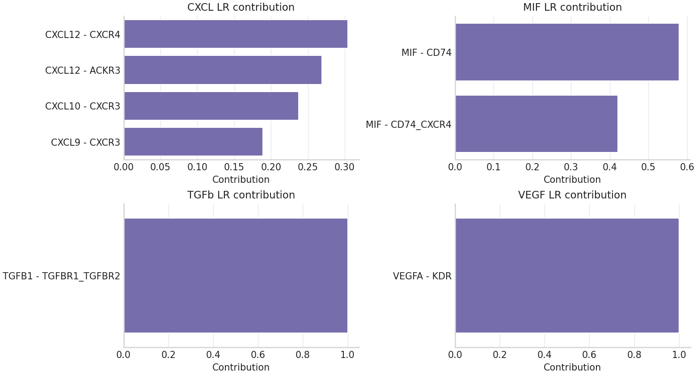

### `signaling_role_heatmap`

`signaling_role_heatmap(result: 'CCCResult', *, mode: 'str' = 'outgoing', pathways: 'Sequence[str] | None' = None, row_scale: 'bool' = True, ax=None, cmap: 'str' = 'pyccc_prob', cluster_rows: 'bool' = False, cluster_cols: 'bool' = False, title: 'str | None' = None)`

CellChat-style signaling role heatmap by pathway and cell group.

```python
cp.signaling_role_heatmap(result, mode="outgoing", cluster_rows=True)
```

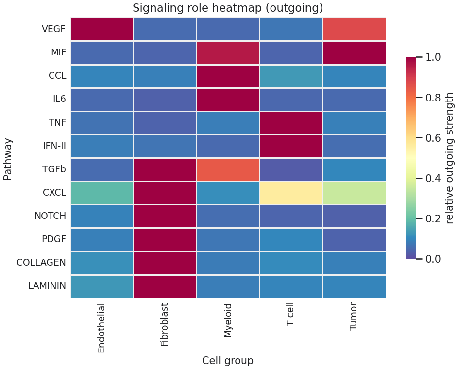

### `signaling_role_heatmap_compare`

`signaling_role_heatmap_compare(diff: 'DifferentialCCC', *, mode: 'str' = 'outgoing', pathways: 'Sequence[str] | None' = None, row_scale: 'bool' = True, axes=None, cmap: 'str' = 'pyccc_prob', cluster_rows: 'bool' = False, cluster_cols: 'bool' = False, title: 'str | None' = None)`

Side-by-side CellChat signaling-role heatmaps for two conditions.

```python
cp.signaling_role_heatmap_compare(diff, mode="outgoing")
```

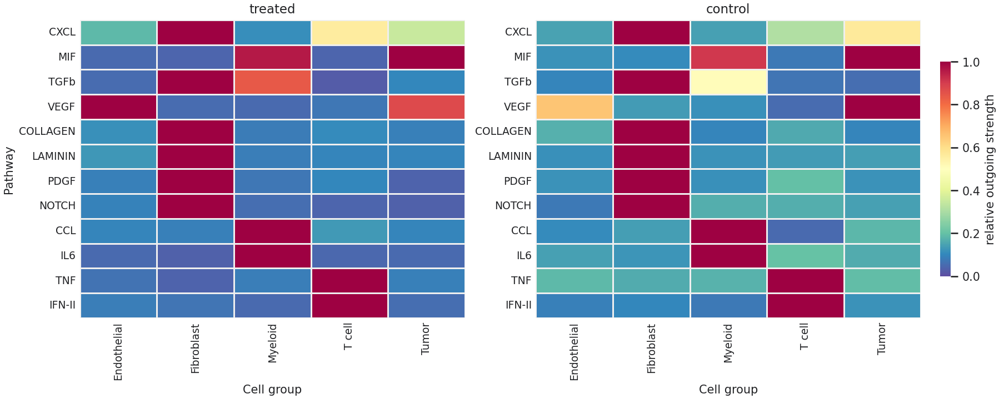

### `pathway_river`

`pathway_river(result: 'CCCResult', *, mode: 'str' = 'outgoing', pathways: 'Sequence[str] | None' = None, groups: 'Sequence[str] | None' = None, top_n: 'int | None' = 12, min_prob: 'float' = 0.0, significant_only: 'bool' = False, ax=None, cmap: 'str' = 'pyccc_cells', title: 'str | None' = None)`

Alluvial river plot linking cell groups to signaling pathways.

```python
cp.pathway_river(result, top_n=12)
```

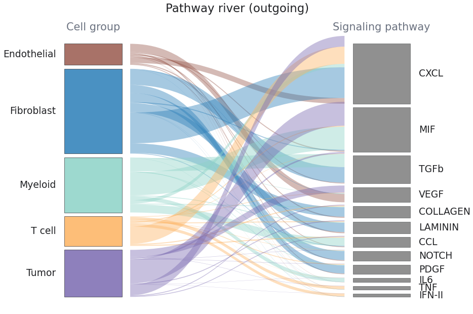

### `rank_signaling_compare`

`rank_signaling_compare(diff: 'DifferentialCCC', *, level: 'str' = 'pathway', top_n: 'int' = 30, stacked: 'bool' = False, ax=None, title: 'str | None' = None)`

Compare ranked pathway or LR information flow between two conditions.

```python
cp.rank_signaling_compare(diff, top_n=12)
```

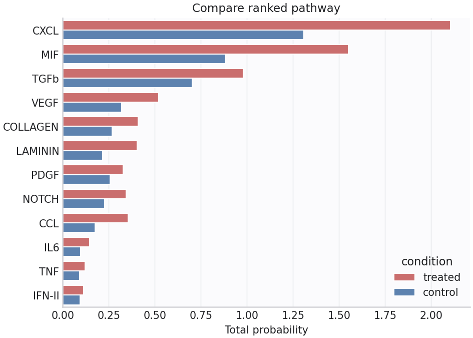

### `compare_interactions`

`compare_interactions(diff: 'DifferentialCCC', *, value: 'str' = 'weight', ax=None, title: 'str | None' = None)`

Bar plot comparing total count or communication weight between conditions.

```python
cp.compare_interactions(diff)
```

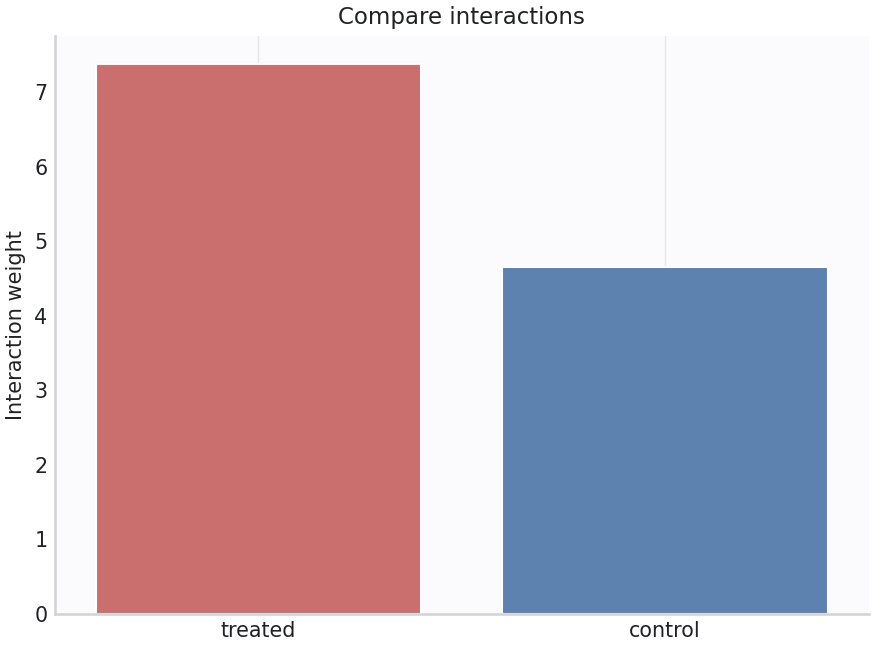

### `diff_network_circle`

`diff_network_circle(diff: 'DifferentialCCC', *, measure: 'str' = 'weight', ax=None, title: 'str | None' = None, pos_color: 'str' = '#d95f5f', neg_color: 'str' = '#4f81bd')`

Differential source-target network circle.

```python
cp.diff_network_circle(diff)
```

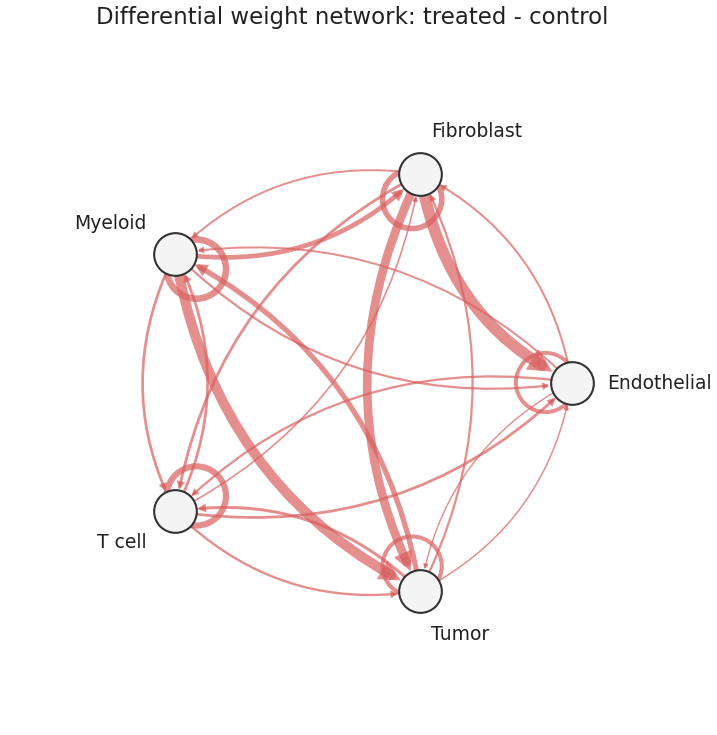

### `diff_heatmap`

`diff_heatmap(diff: 'DifferentialCCC', *, measure: 'str' = 'weight', ax=None, cmap: 'str' = 'pyccc_diff', annot: 'bool' = False, cluster_rows: 'bool' = False, cluster_cols: 'bool' = False, title: 'str | None' = None)`

Heatmap of source-target differential communication.

```python
cp.diff_heatmap(diff, cluster_rows=True, cluster_cols=True)
```

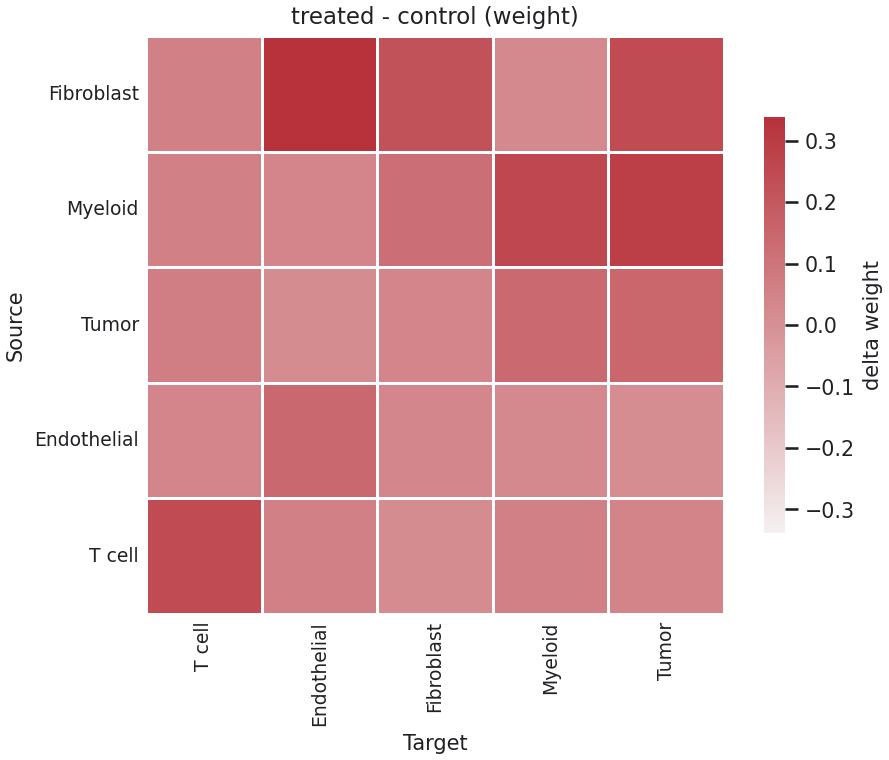

### `diff_bubble`

`diff_bubble(diff: 'DifferentialCCC', *, sources: 'Sequence[str] | None' = None, targets: 'Sequence[str] | None' = None, pathways: 'Sequence[str] | None' = None, top_n: 'int | None' = 40, top_pairs: 'int | None' = None, compact_pairs: 'bool' = False, max_pvalue: 'float | None' = None, show_size_legend: 'bool' = True, ax=None, cmap: 'str' = 'pyccc_diff', title: 'str | None' = None)`

Differential ligand-receptor bubble plot.

```python
cp.diff_bubble(diff, top_n=16, compact_pairs=True)
```

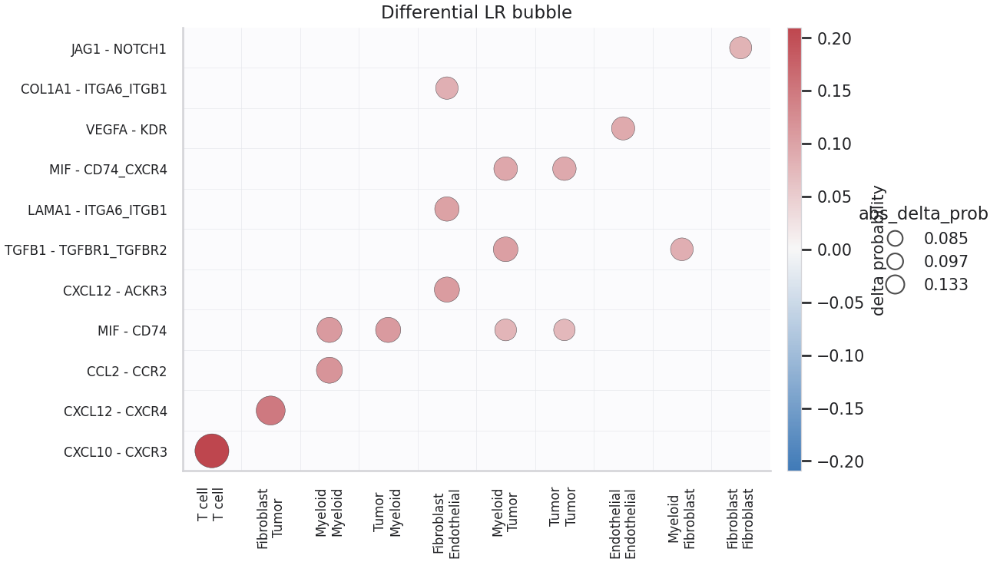

### `diff_pathway_rank`

`diff_pathway_rank(diff: 'DifferentialCCC', *, top_n: 'int' = 30, measure: 'str' = 'weight', ax=None, title: 'str | None' = None, pos_color: 'str' = '#d95f5f', neg_color: 'str' = '#4f81bd')`

CellChat `rankNet`-style pathway differential ranking.

```python
cp.diff_pathway_rank(diff, top_n=12)
```

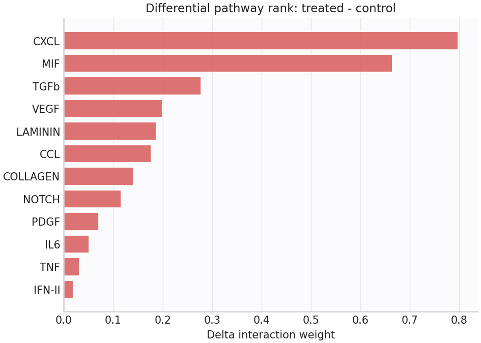

### `diff_source_target_rank`

`diff_source_target_rank(diff: 'DifferentialCCC', *, top_n: 'int' = 30, measure: 'str' = 'weight', ax=None, title: 'str | None' = None, pos_color: 'str' = '#d95f5f', neg_color: 'str' = '#4f81bd')`

Rank source-target pairs by differential communication.

```python
cp.diff_source_target_rank(diff, top_n=12)
```

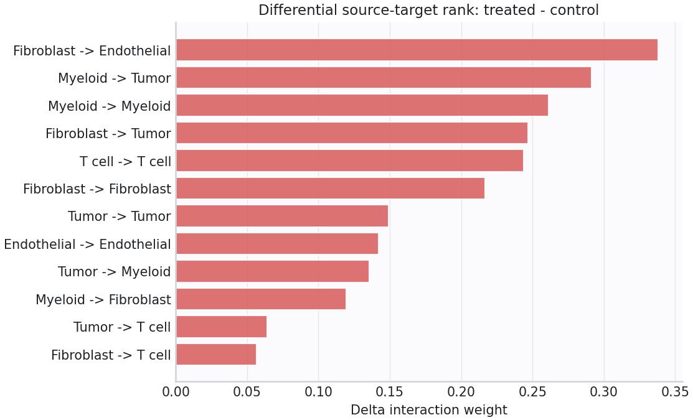

### `signaling_changes_scatter`

`signaling_changes_scatter(diff: 'DifferentialCCC', group: 'str', *, pathways: 'Sequence[str] | None' = None, exclude_pathways: 'Sequence[str] | None' = None, top_label: 'float | int' = 0.35, ax=None, title: 'str | None' = None)`

CellChat `netAnalysis_signalingChanges_scatter` style pathway-change scatter.

```python
cp.signaling_changes_scatter(diff, "Tumor")
```

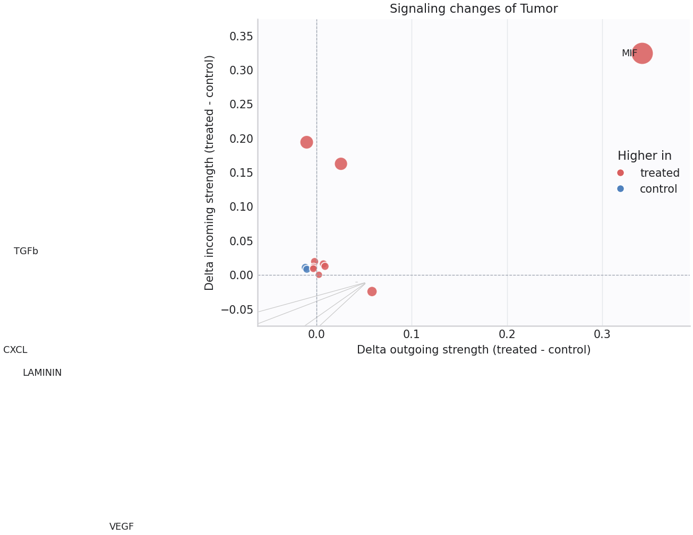

### `pathway_similarity_rank`

`pathway_similarity_rank(diff: 'DifferentialCCC', *, similarity: 'str' = 'functional', top_n: 'int' = 30, method: 'str' = 'auto', n_neighbors: 'int | None' = None, min_dist: 'float' = 0.3, random_state: 'int | None' = 0, ax=None, title: 'str | None' = None)`

CellChat `rankSimilarity` style ranking of pathway distances.

```python
cp.pathway_similarity_rank(diff, top_n=12, method="mds")
```

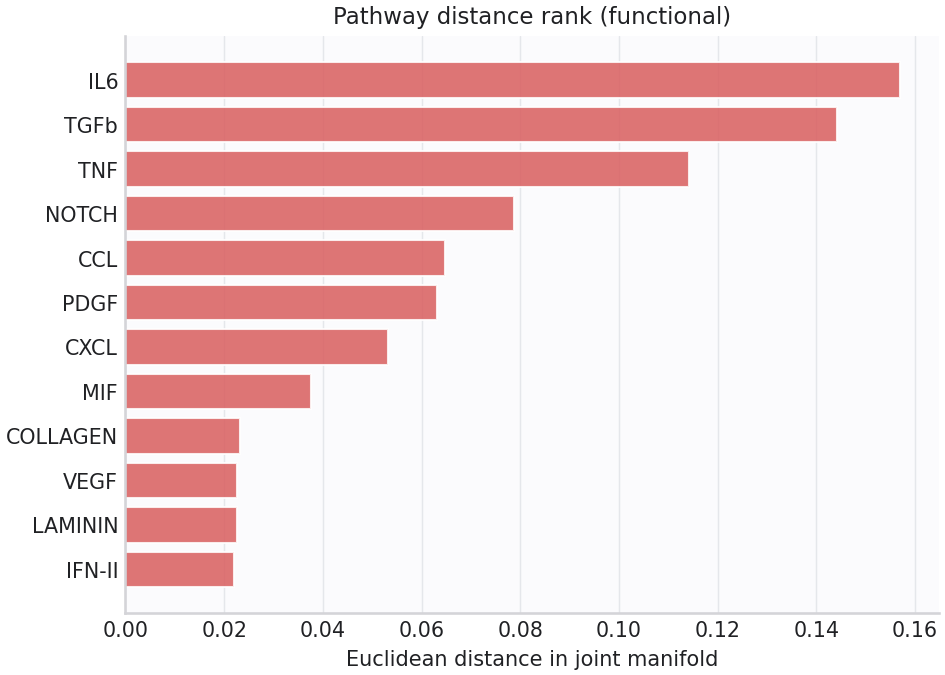

### `pathway_embedding_pairwise`

`pathway_embedding_pairwise(diff: 'DifferentialCCC', *, similarity: 'str' = 'functional', significant_only: 'bool' = False, min_prob: 'float' = 0.0, thresh: 'float | None' = None, method: 'str' = 'auto', n_neighbors: 'int | None' = None, min_dist: 'float' = 0.3, random_state: 'int | None' = 0, remove_isolates: 'bool' = True, top_label: 'float | int' = 0.35, label_pathways: 'Sequence[str] | None' = None, connect: 'bool' = True, ax=None, title: 'str | None' = None)`

CellChat `netVisual_embeddingPairwise` style joint pathway embedding.

```python
cp.pathway_embedding_pairwise(diff, method="mds", top_label=4)
```

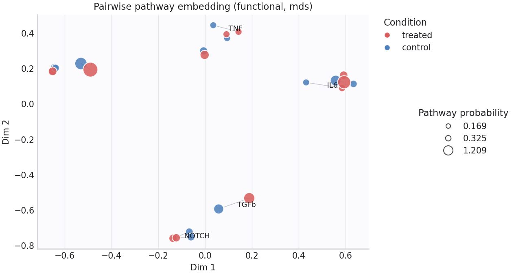

### `centrality_network`

`centrality_network(result: 'CCCResult') -> 'pd.DataFrame'`

Return basic outgoing/incoming/degree centrality values.

```python
cp.centrality_network(result).head()
```

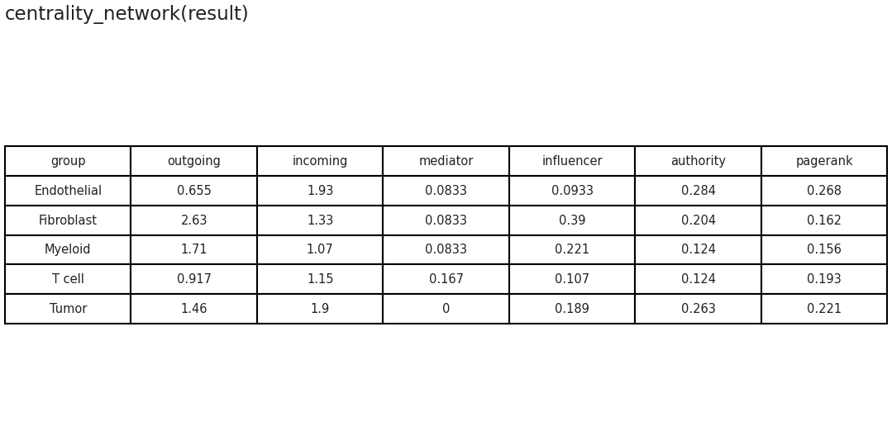

### `signaling_role_network`

`signaling_role_network(result: 'CCCResult', *, pathway: 'str | Sequence[str] | None' = None, roles: 'Sequence[str]' = ('sender', 'receiver', 'mediator', 'influencer'), normalize: 'bool' = True, significant_only: 'bool' = False, ax=None, cmap: 'str' = 'pyccc_prob', annot: 'bool' = False, title: 'str | None' = None)`

CellChat-style heatmap of sender/receiver/mediator/influencer roles.

```python
cp.signaling_role_network(result, annot=True)
```

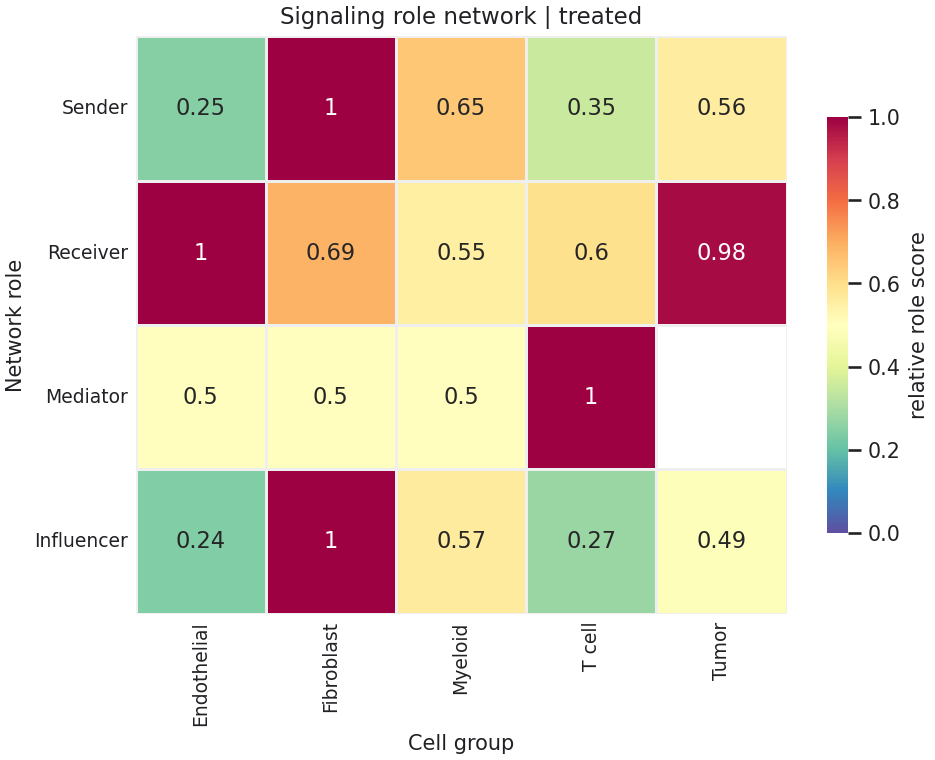

### `pathway_embedding`

`pathway_embedding(result: 'CCCResult', *, similarity: 'str' = 'functional', significant_only: 'bool' = False, min_prob: 'float' = 0.0, thresh: 'float | None' = None, method: 'str' = 'auto', n_neighbors: 'int | None' = None, min_dist: 'float' = 0.3, random_state: 'int | None' = 0, remove_isolates: 'bool' = True, cluster: 'bool' = False, n_clusters: 'int | None' = None, cluster_method: 'str' = 'spectral', top_label: 'float | int' = 1.0, label_pathways: 'Sequence[str] | None' = None, ax=None, cmap: 'str' = 'pyccc_prob', title: 'str | None' = None)`

CellChat-style 2D embedding of signaling pathways by network similarity.

```python
cp.pathway_embedding(result, cluster=True, n_clusters=3, method="mds")
```

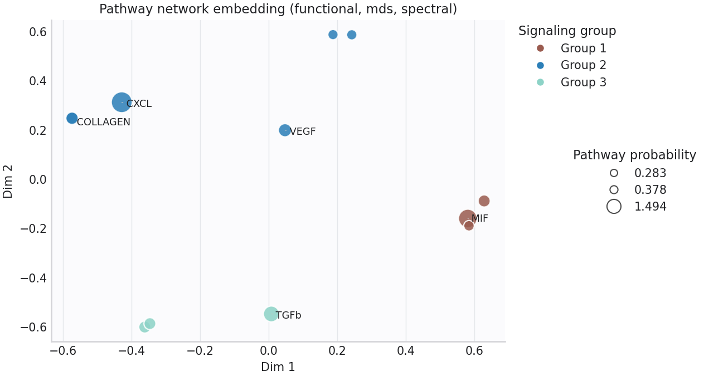

### `signaling_gene_expression`

`signaling_gene_expression(adata, groupby: 'str | None' = None, *, result: 'CCCResult | None' = None, genes: 'Sequence[str] | None' = None, features: 'Sequence[str] | None' = None, signaling: 'str | Sequence[str] | None' = None, lr_table=None, enriched_only: 'bool' = True, kind: 'str' = 'dot', include_cofactors: 'bool' = False, groups: 'Sequence[str] | None' = None, layer: 'str | None' = None, use_raw: 'bool' = False, gene_symbols_key: 'str | None' = None, aggregate: 'str' = 'mean', trim: 'float' = 0.1, standard_scale: 'bool' = True, scale_min: 'float' = -2.5, scale_max: 'float' = 2.5, min_pct: 'float' = 0.0, max_cells_per_group: 'int | None' = None, random_state: 'int | None' = 0, ax=None, cmap: 'str' = 'pyccc_expr', title: 'str | None' = None)`

AnnData-native CellChat `plotGeneExpression`-style expression plot.

```python
cp.signaling_gene_expression(adata, result=result, signaling="CXCL")
```

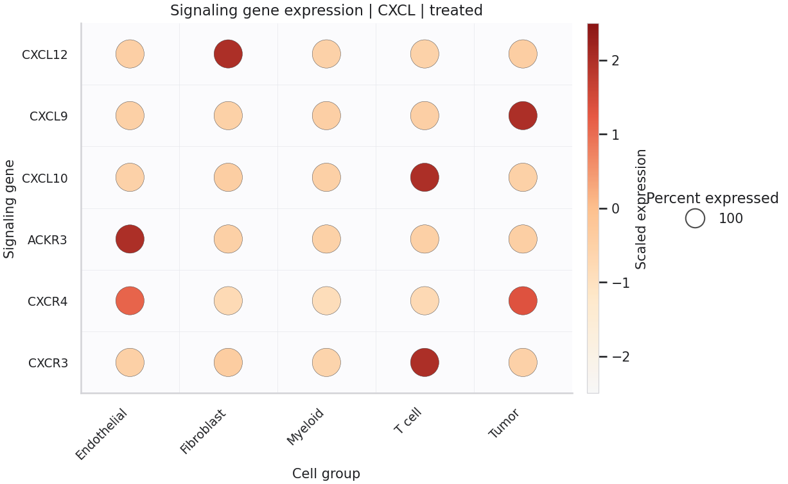

### `spatial_network`

`spatial_network(adata, result: 'CCCResult', *, groupby: 'str | None' = None, basis: 'str' = 'spatial', pathway: 'str | Sequence[str] | None' = None, weight: 'str' = 'prob', significant_only: 'bool' = False, show_cells: 'bool' = True, ax=None, cmap: 'str' = 'pyccc_cells', title: 'str | None' = None)`

Spatial cell-cell communication network over group centroids.

```python
cp.spatial_network(adata, result, pathway="CXCL")
```

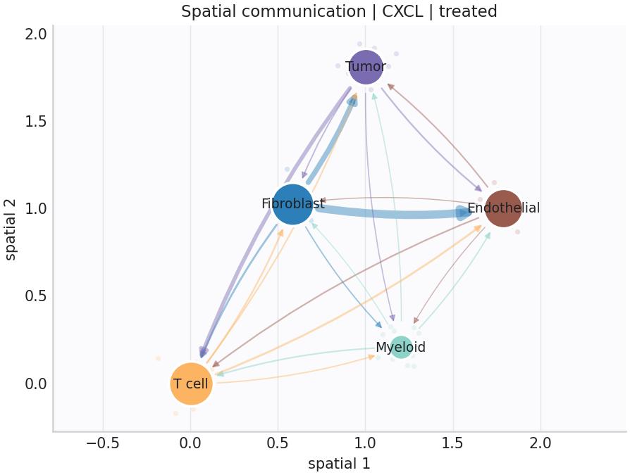

### `key_plot_gallery`

`key_plot_gallery(result: 'CCCResult', diff: 'DifferentialCCC | None' = None, *, figsize: 'tuple[float, float] | None' = None)`

Create a CellChat-style gallery of the main pyccc visual summaries.

```python
cp.key_plot_gallery(result, diff)
```

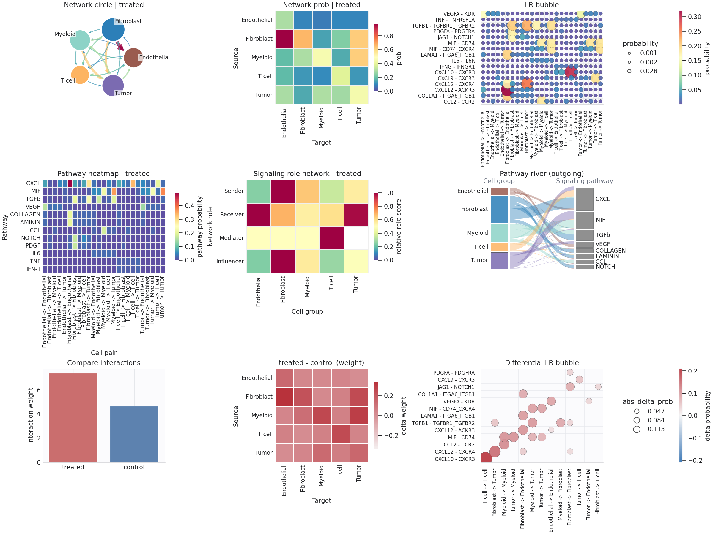

### `masterpiece_gallery`

`masterpiece_gallery(result: 'CCCResult', diff: 'DifferentialCCC | None' = None, *, title: 'str' = 'Cell-cell communication atlas', subtitle: 'str | None' = None, outfile: 'str | None' = None, dpi: 'int' = 360)`

Create a polished multi-panel figure intended for publication/export.

```python
cp.masterpiece_gallery(result, diff)
```

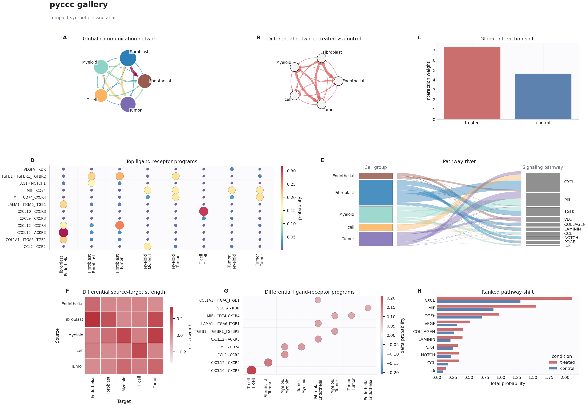

## Plotnine API

### `bubble`

`bubble(result: 'CCCResult', *, sources: 'Sequence[str] | None' = None, targets: 'Sequence[str] | None' = None, pathways: 'Sequence[str] | None' = None, interactions: 'Sequence[str] | None' = None, top_n: 'int | None' = None, top_pairs: 'int | None' = None, compact_pairs: 'bool' = False, size_by: 'str' = 'prob', max_pvalue: 'float | None' = None, significant_only: 'bool' = False, facet_by: 'str | None' = None, title: 'str' = 'LR bubble')`

Plotnine version of the CellChat-style ligand-receptor bubble plot.

```python
cg.bubble(result, top_n=16)
```

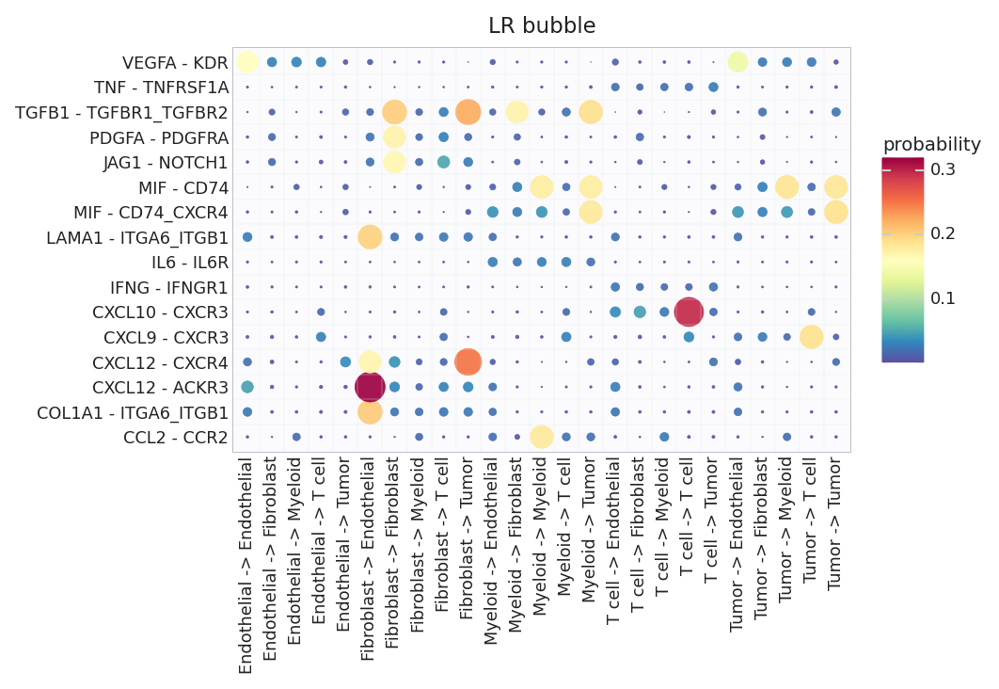

### `diff_bubble`

`diff_bubble(diff: 'DifferentialCCC', *, sources: 'Sequence[str] | None' = None, targets: 'Sequence[str] | None' = None, pathways: 'Sequence[str] | None' = None, top_n: 'int | None' = 40, top_pairs: 'int | None' = None, compact_pairs: 'bool' = False, max_pvalue: 'float | None' = None, facet_by: 'str | None' = None, title: 'str' = 'Differential LR bubble')`

Plotnine differential ligand-receptor bubble plot.

```python
cg.diff_bubble(diff, top_n=16)
```

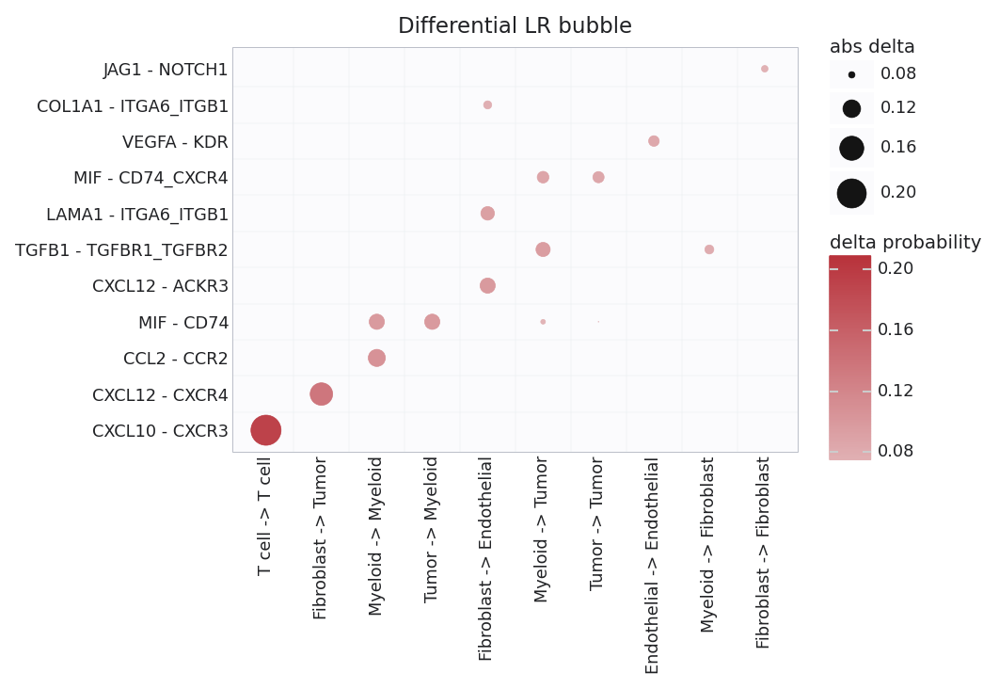

### `diff_pathway_rank`

`diff_pathway_rank(diff: 'DifferentialCCC', *, top_n: 'int' = 30, measure: 'str' = 'weight', title: 'str | None' = None)`

Plotnine CellChat `rankNet`-style pathway differential ranking.

```python
cg.diff_pathway_rank(diff, top_n=12)
```

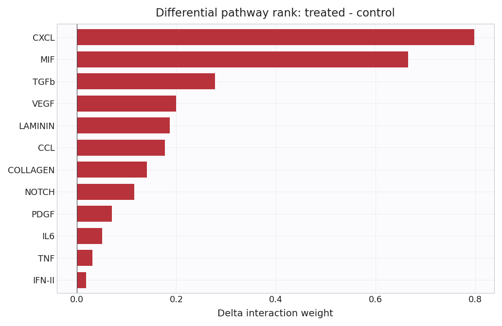

### `diff_source_target_rank`

`diff_source_target_rank(diff: 'DifferentialCCC', *, top_n: 'int' = 30, measure: 'str' = 'weight', title: 'str | None' = None)`

Plotnine source-target differential ranking.

```python
cg.diff_source_target_rank(diff, top_n=12)
```

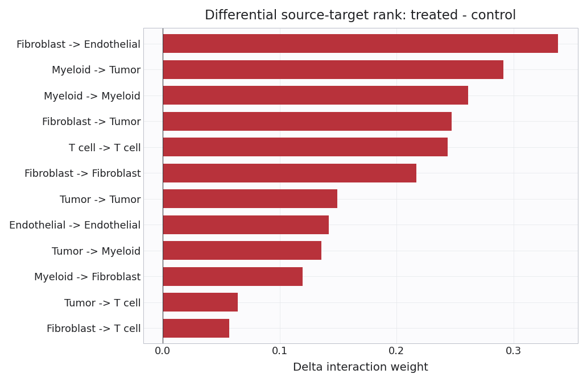

### `signaling_changes_scatter`

`signaling_changes_scatter(diff: 'DifferentialCCC', group: 'str', *, pathways: 'Sequence[str] | None' = None, exclude_pathways: 'Sequence[str] | None' = None, top_label: 'float | int' = 0.35, title: 'str | None' = None)`

Plotnine CellChat-style signaling-change scatter for one cell group.

```python
cg.signaling_changes_scatter(diff, "Tumor")
```

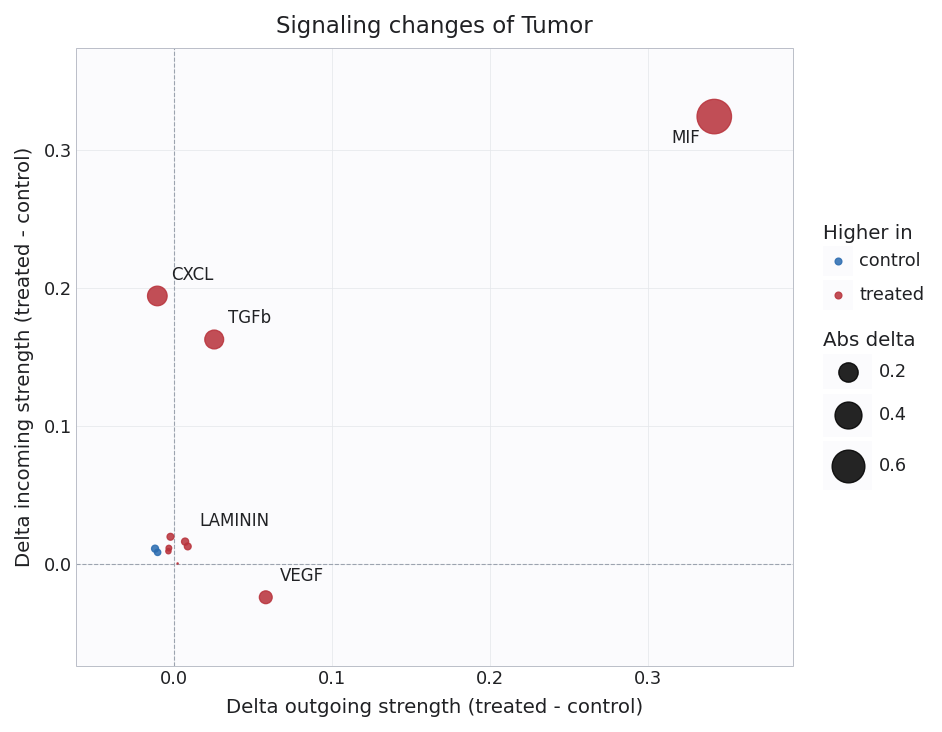

### `pathway_similarity_rank`

`pathway_similarity_rank(diff: 'DifferentialCCC', *, similarity: 'str' = 'functional', top_n: 'int' = 30, method: 'str' = 'auto', n_neighbors: 'int | None' = None, min_dist: 'float' = 0.3, random_state: 'int | None' = 0, title: 'str | None' = None)`

Plotnine CellChat `rankSimilarity`-style pathway distance ranking.

```python
cg.pathway_similarity_rank(diff, top_n=12, method="mds")
```

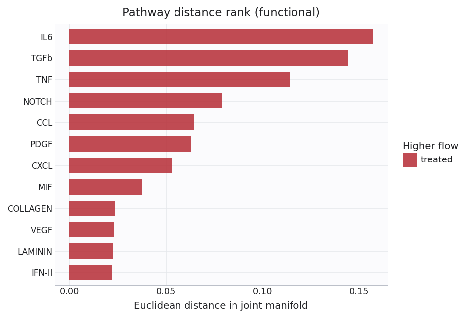

### `pathway_embedding_pairwise`

`pathway_embedding_pairwise(diff: 'DifferentialCCC', *, similarity: 'str' = 'functional', significant_only: 'bool' = False, min_prob: 'float' = 0.0, thresh: 'float | None' = None, method: 'str' = 'auto', n_neighbors: 'int | None' = None, min_dist: 'float' = 0.3, random_state: 'int | None' = 0, remove_isolates: 'bool' = True, top_label: 'float | int' = 0.35, label_pathways: 'Sequence[str] | None' = None, connect: 'bool' = True, title: 'str | None' = None)`

Plotnine CellChat `netVisual_embeddingPairwise`-style joint embedding.

```python
cg.pathway_embedding_pairwise(diff, method="mds", top_label=4)
```

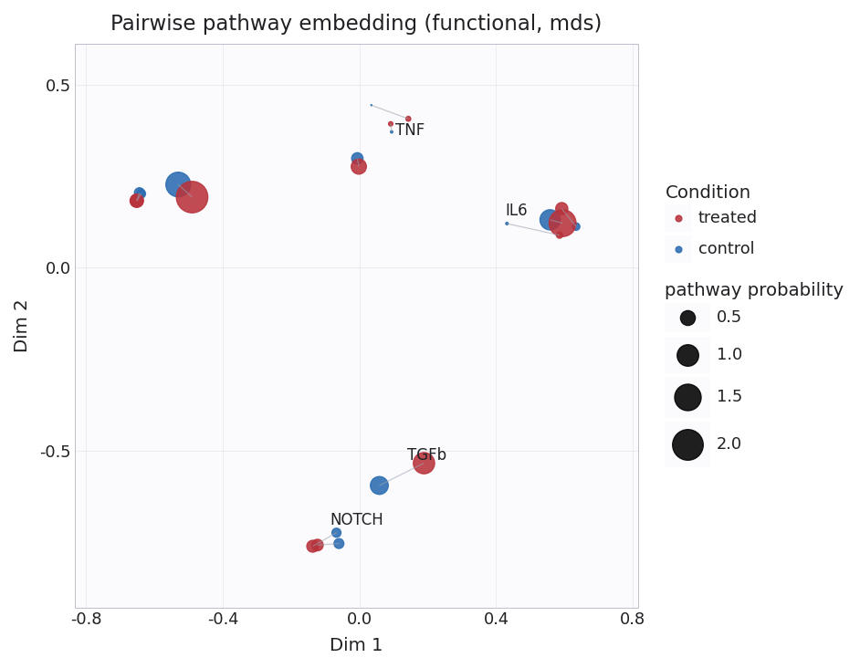

### `dotplot`

`dotplot(result: 'CCCResult', *, level: 'str' = 'pathway', top_n: 'int' = 30, title: 'str | None' = None)`

Plotnine dotplot ranking pathways or ligand-receptor pairs.

```python
cg.dotplot(result, top_n=16)
```

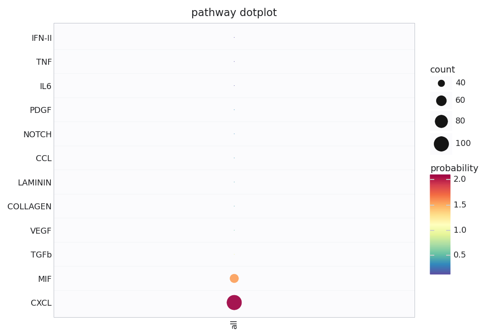

### `signaling_role_scatter`

`signaling_role_scatter(result: 'CCCResult', *, pathways: 'str | Sequence[str] | None' = None, significant_only: 'bool' = False, label: 'bool' = True, title: 'str | None' = None)`

Plotnine CellChat-style outgoing-vs-incoming signaling role scatter.

```python
cg.signaling_role_scatter(result)
```

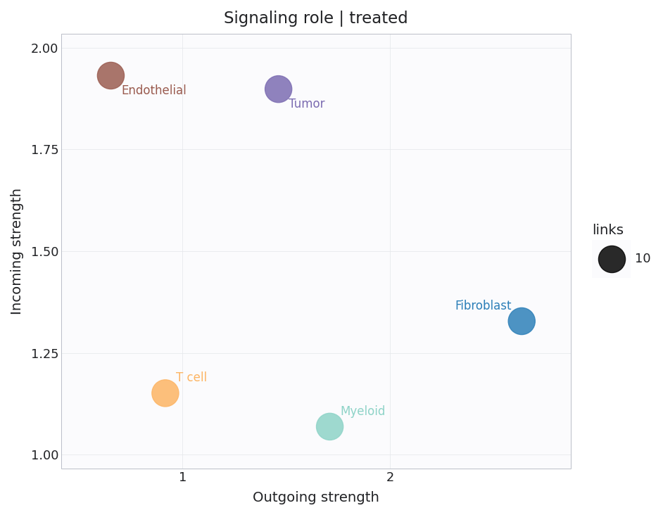

### `lr_contribution`

`lr_contribution(result: 'CCCResult', pathway: 'str', *, top_n: 'int' = 20, title: 'str | None' = None)`

Plotnine CellChat-style LR contribution plot within one pathway.

```python
cg.lr_contribution(result, "CXCL", top_n=8)
```

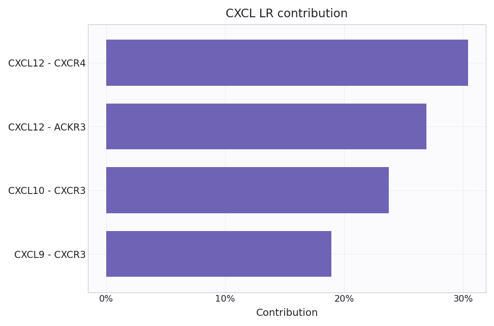

### `lr_contribution_multi`

`lr_contribution_multi(result: 'CCCResult', *, pathways: 'Sequence[str] | None' = None, top_pathways: 'int' = 6, top_n: 'int' = 8, significant_only: 'bool' = False, title: 'str | None' = None)`

Plotnine faceted CellChat `netAnalysis_contribution`-style LR contribution plot.

```python
cg.lr_contribution_multi(result, pathways=["CXCL", "MIF", "TGFb", "VEGF"])
```

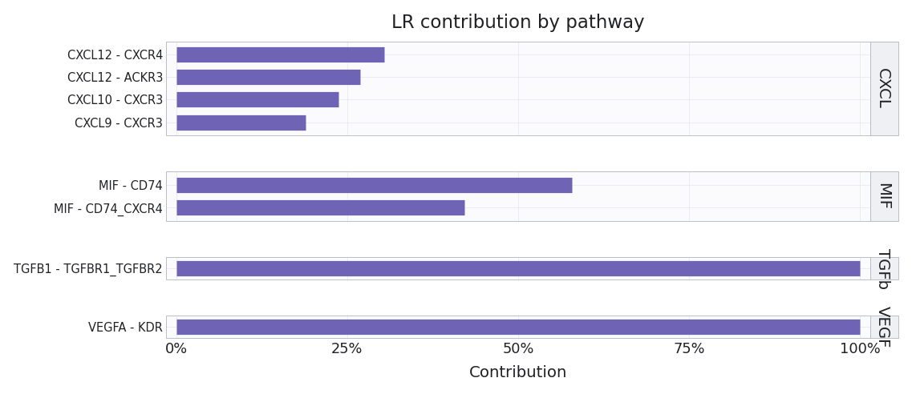

### `pathway_embedding`

`pathway_embedding(result: 'CCCResult', *, similarity: 'str' = 'functional', significant_only: 'bool' = False, min_prob: 'float' = 0.0, thresh: 'float | None' = None, method: 'str' = 'auto', n_neighbors: 'int | None' = None, min_dist: 'float' = 0.3, random_state: 'int | None' = 0, remove_isolates: 'bool' = True, cluster: 'bool' = False, n_clusters: 'int | None' = None, cluster_method: 'str' = 'spectral', top_label: 'float | int' = 1.0, label_pathways: 'Sequence[str] | None' = None, title: 'str | None' = None)`

Plotnine CellChat-style embedding of signaling pathway networks.

```python
cg.pathway_embedding(result, cluster=True, n_clusters=3, method="mds")
```

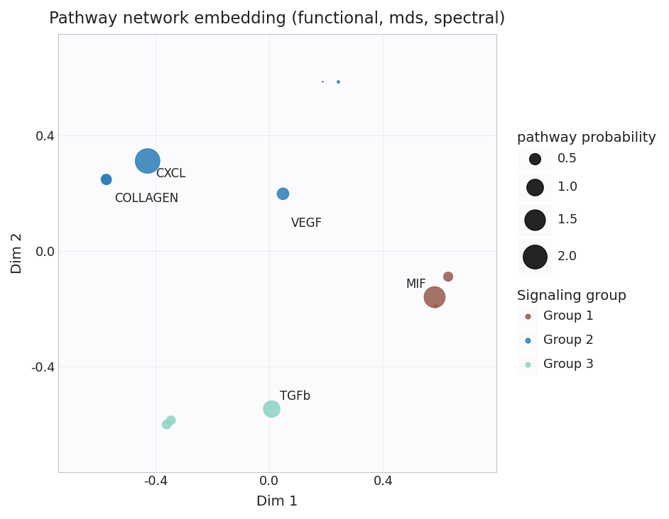

### `signaling_gene_expression`

`signaling_gene_expression(adata, groupby: 'str | None' = None, *, result: 'CCCResult | None' = None, genes: 'Sequence[str] | None' = None, features: 'Sequence[str] | None' = None, signaling: 'str | Sequence[str] | None' = None, lr_table=None, enriched_only: 'bool' = True, kind: 'str' = 'dot', include_cofactors: 'bool' = False, groups: 'Sequence[str] | None' = None, layer: 'str | None' = None, use_raw: 'bool' = False, gene_symbols_key: 'str | None' = None, aggregate: 'str' = 'mean', trim: 'float' = 0.1, standard_scale: 'bool' = True, scale_min: 'float' = -2.5, scale_max: 'float' = 2.5, min_pct: 'float' = 0.0, max_cells_per_group: 'int | None' = None, random_state: 'int | None' = 0, title: 'str | None' = None)`

Plotnine AnnData-native CellChat `plotGeneExpression` equivalent.

```python
cg.signaling_gene_expression(adata, result=result, signaling="CXCL")
```

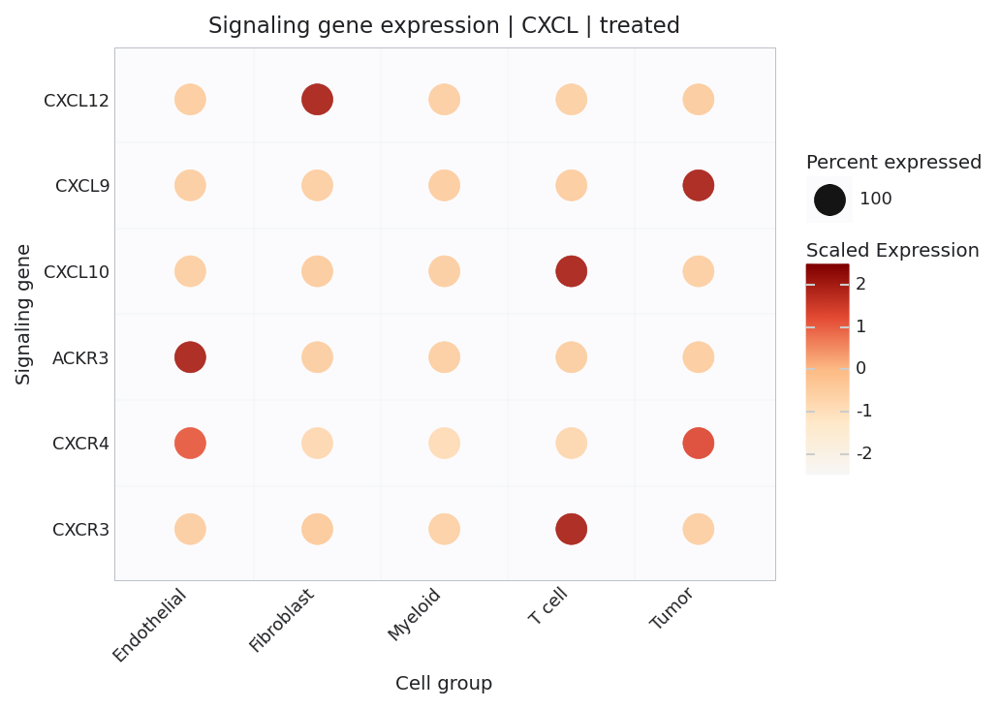

### `signaling_role_heatmap_compare`

`signaling_role_heatmap_compare(diff: 'DifferentialCCC', *, mode: 'str' = 'outgoing', pathways: 'Sequence[str] | None' = None, row_scale: 'bool' = True, cluster_rows: 'bool' = False, cluster_cols: 'bool' = False, title: 'str | None' = None)`

Plotnine side-by-side CellChat signaling-role heatmaps for two conditions.

```python
cg.signaling_role_heatmap_compare(diff, mode="outgoing")
```

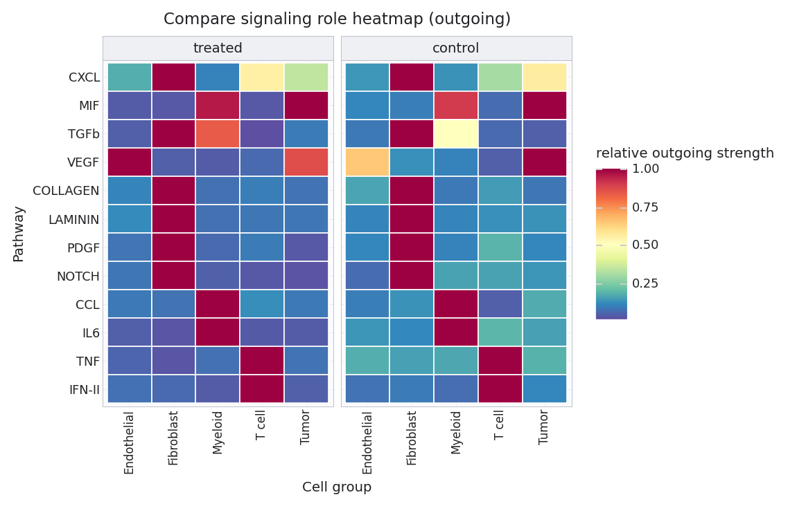

### `pathway_heatmap`

`pathway_heatmap(result: 'CCCResult', *, pathways: 'Sequence[str] | None' = None, source: 'str | None' = None, target: 'str | None' = None, top_pairs: 'int | None' = None, compact_pairs: 'bool' = False, significant_only: 'bool' = False, cluster_rows: 'bool' = False, cluster_cols: 'bool' = False, title: 'str' = 'Pathway heatmap')`

Plotnine pathway-level source-target heatmap.

```python
cg.pathway_heatmap(result, top_pairs=14, compact_pairs=True)
```

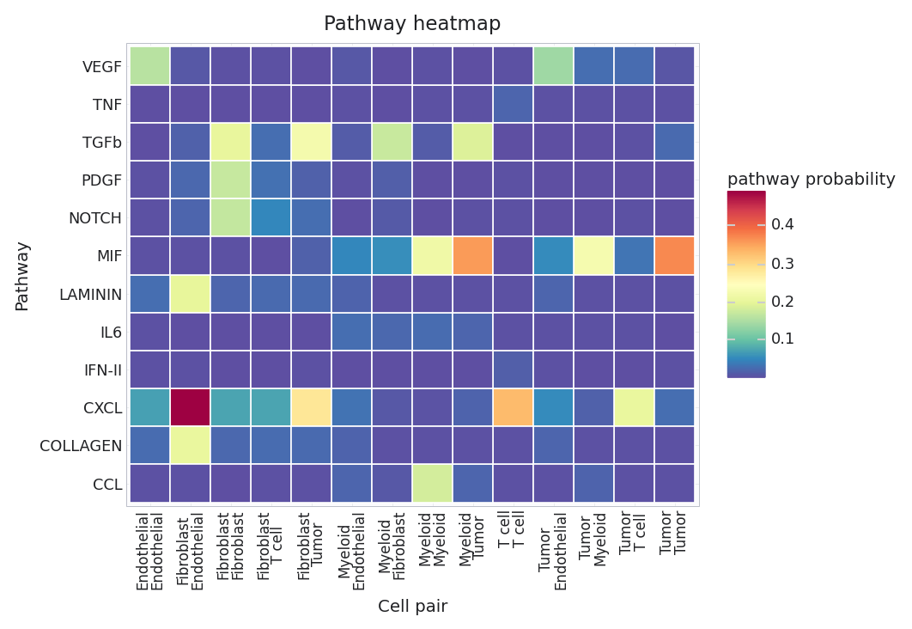

### `rank_signaling`

`rank_signaling(result: 'CCCResult', *, level: 'str' = 'pathway', top_n: 'int' = 30, title: 'str | None' = None)`

Plotnine horizontal rank plot for pathways or ligand-receptor pairs.

```python
cg.rank_signaling(result, top_n=12)
```

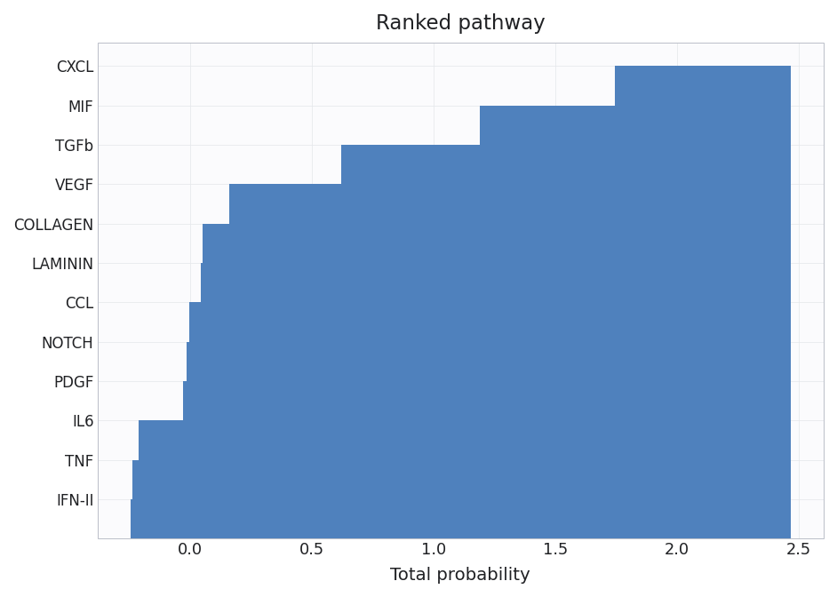

### `rank_signaling_compare`

`rank_signaling_compare(diff: 'DifferentialCCC', *, level: 'str' = 'pathway', top_n: 'int' = 30, stacked: 'bool' = False, title: 'str | None' = None)`

Plotnine comparison of ranked pathway or LR information flow.

```python
cg.rank_signaling_compare(diff, top_n=12)
```

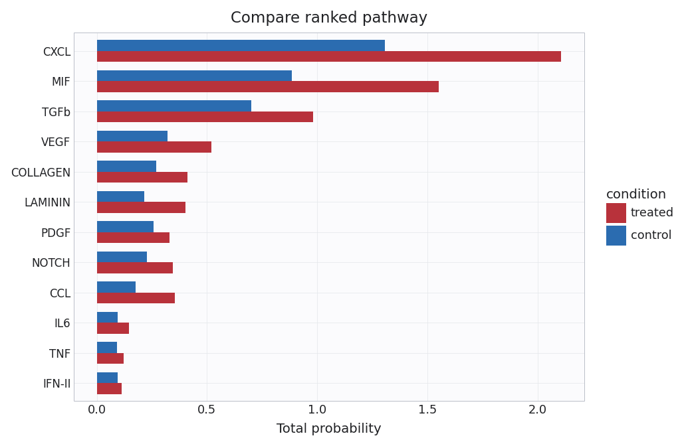

### `annotation_bar`

`annotation_bar(result: 'CCCResult', *, value: 'str' = 'prob', significant_only: 'bool' = False, title: 'str' = 'Annotation composition')`

Plotnine bar plot by CellChatDB annotation class.

```python
cg.annotation_bar(result)
```

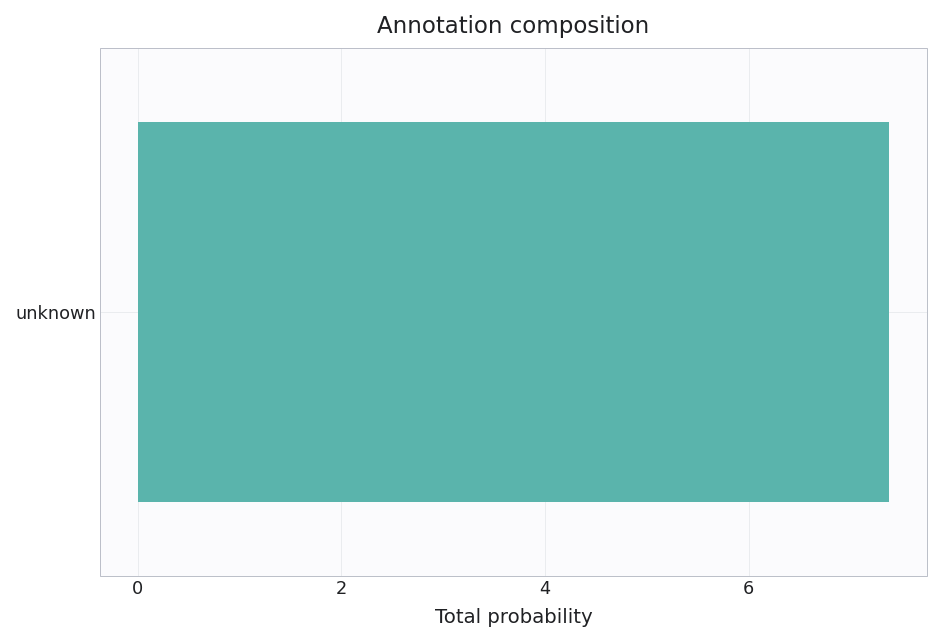

### `compare_interactions`

`compare_interactions(diff: 'DifferentialCCC', *, value: 'str' = 'weight', title: 'str | None' = None)`

Plotnine comparison of global interaction count or weight.

```python
cg.compare_interactions(diff)
```

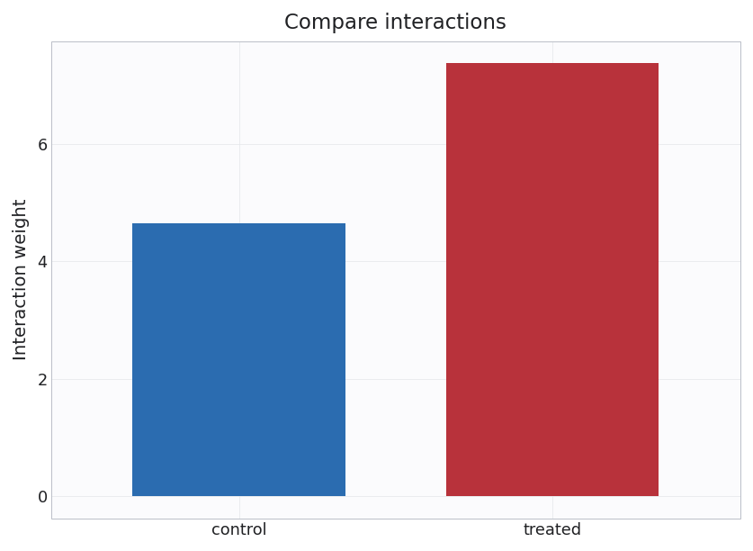

### `pathway_river`

`pathway_river(result: 'CCCResult', *, mode: 'str' = 'outgoing', pathways: 'Sequence[str] | None' = None, groups: 'Sequence[str] | None' = None, top_n: 'int | None' = 12, min_prob: 'float' = 0.0, significant_only: 'bool' = False, title: 'str | None' = None)`

Plotnine alluvial-style river from cell groups to signaling pathways.

```python
cg.pathway_river(result, top_n=12)
```

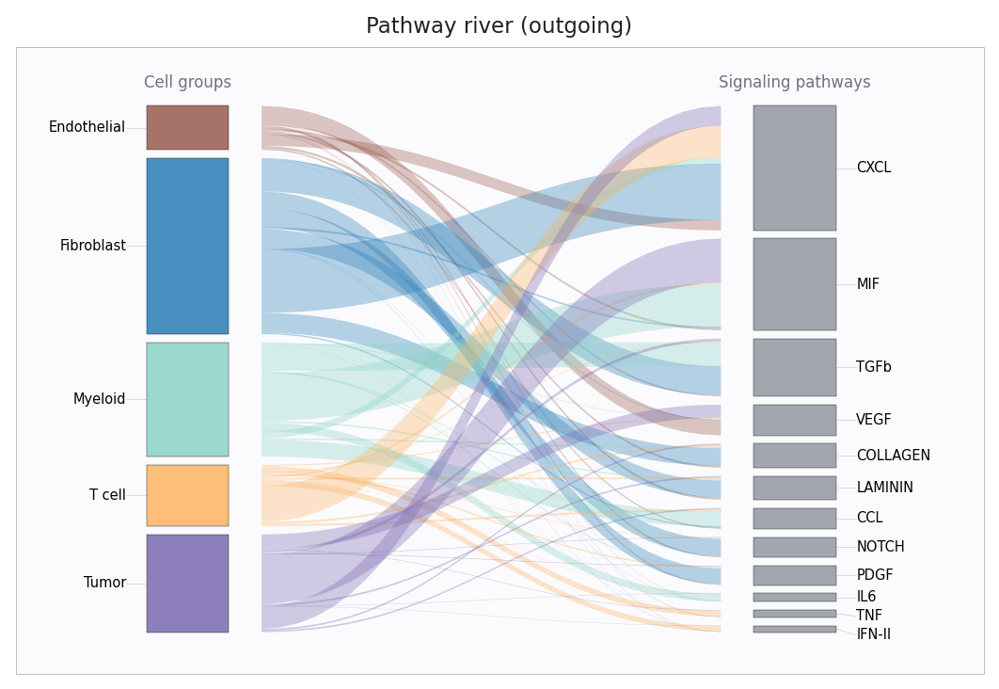

### `pattern_dot`

`pattern_dot(patterns: 'CommunicationPatterns', *, kind: 'str' = 'pathway', top_n: 'int | None' = 30, title: 'str | None' = None)`

CellChat-style pattern dot plot for pathway or cell-group loadings.

```python
cg.pattern_dot(patterns)
```

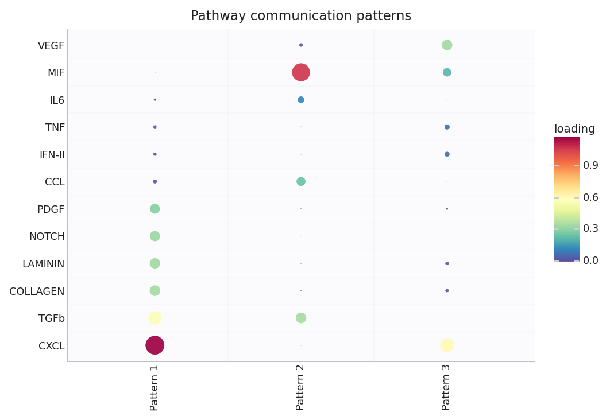

### `pattern_river`

`pattern_river(patterns: 'CommunicationPatterns', *, top_groups: 'int | None' = 12, top_pathways: 'int | None' = 18, title: 'str | None' = None)`

Plotnine three-stage river: cell groups -> latent patterns -> pathways.

```python
cg.pattern_river(patterns)
```

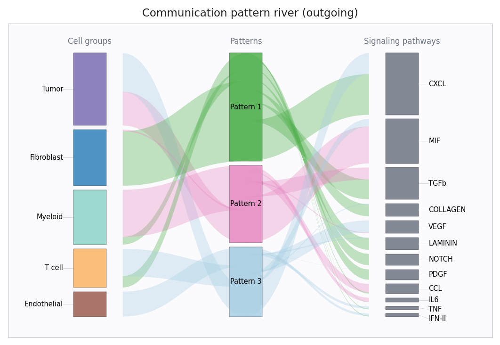

### `pattern_number_plot`

`pattern_number_plot(selection: 'pd.DataFrame', *, recommended_k: 'int | None' = None, title: 'str' = 'Pattern number diagnostics')`

Plotnine selectK-style diagnostics for candidate NMF pattern counts.

```python
cg.pattern_number_plot(selection)
```

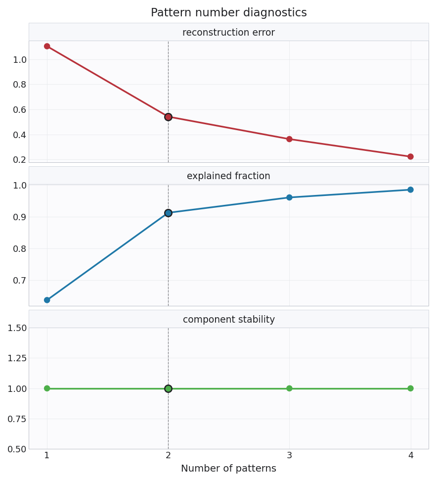

## Interactive and Report Helpers

### `interactive_pathway_river`

`interactive_pathway_river(result: 'CCCResult', *, mode: 'str' = 'outgoing', pathways: 'Sequence[str] | None' = None, groups: 'Sequence[str] | None' = None, top_n: 'int | None' = 12, min_prob: 'float' = 0.0, significant_only: 'bool' = False, title: 'str | None' = None, width: 'int' = 1100, height: 'int' = 720)`

Interactive Plotly Sankey from cell groups to signaling pathways.

```python
fig = pc.interactive_pathway_river(result, top_n=12)
```


[Open generated HTML](_static/interactive/interactive_pathway_river.html)

### `interactive_pattern_river`

`interactive_pattern_river(patterns: 'CommunicationPatterns', *, top_groups: 'int | None' = 12, top_pathways: 'int | None' = 18, title: 'str | None' = None, width: 'int' = 1200, height: 'int' = 760)`

Interactive Plotly Sankey for cell groups -> latent patterns -> pathways.

```python
fig = pc.interactive_pattern_river(patterns)
```

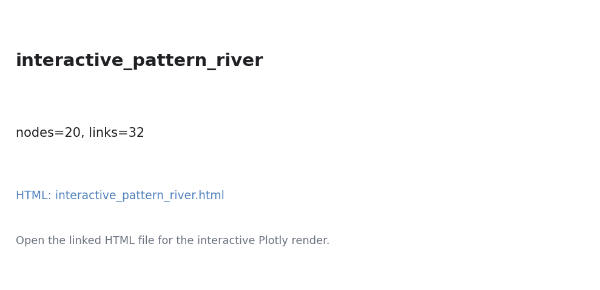

[Open generated HTML](_static/interactive/interactive_pattern_river.html)

### `save_interactive_html`

`save_interactive_html(fig, path: 'str | Path', *, include_plotlyjs: 'str | bool' = 'cdn') -> 'Path'`

Save a Plotly figure as a standalone or CDN-backed HTML document.

```python
pc.save_interactive_html(fig, "pathway_river.html")
```

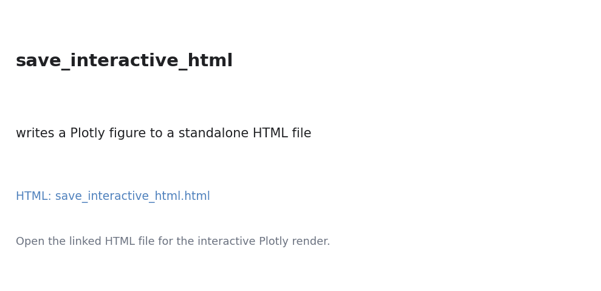

[Open generated HTML](_static/interactive/save_interactive_html.html)

### `save_cellchat_report`

`save_cellchat_report(result: 'CCCResult', outfile: 'str | Path', *, diff: 'DifferentialCCC | None' = None, title: 'str' = 'pyccc CellChat-style report', dpi: 'int' = 180) -> 'Path'`

Save a multi-page CellChat-style visual report as PDF.

```python
pc.save_cellchat_report(result, "cellchat_report.pdf", diff=diff)
```

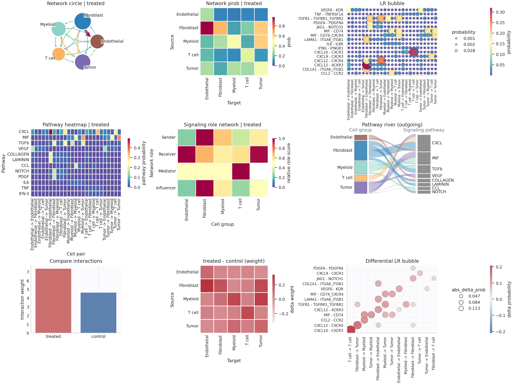

[Open generated report PDF](_static/reports/cellchat_report.pdf)
